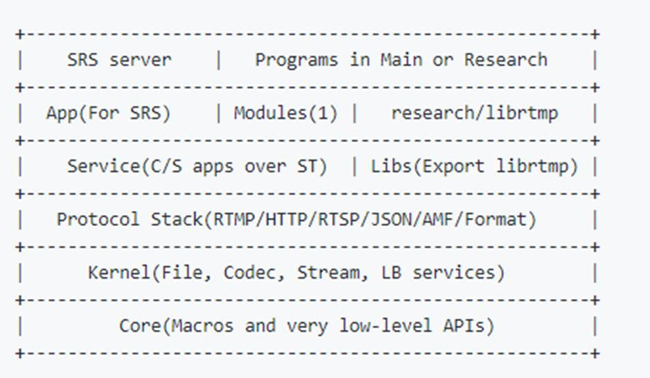
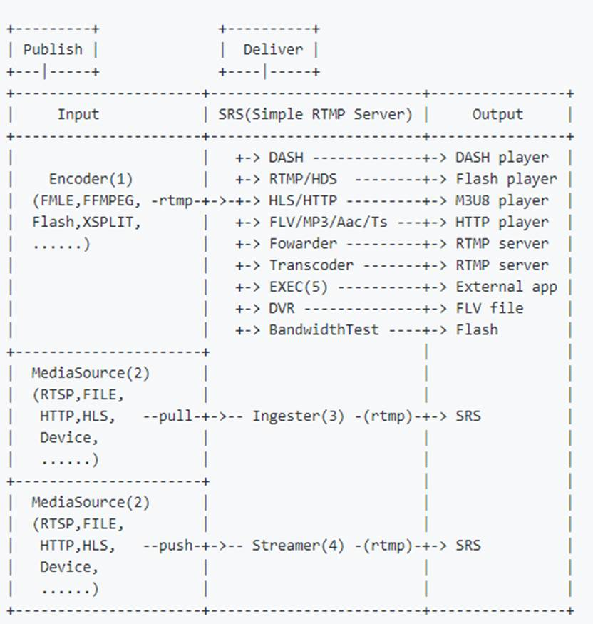
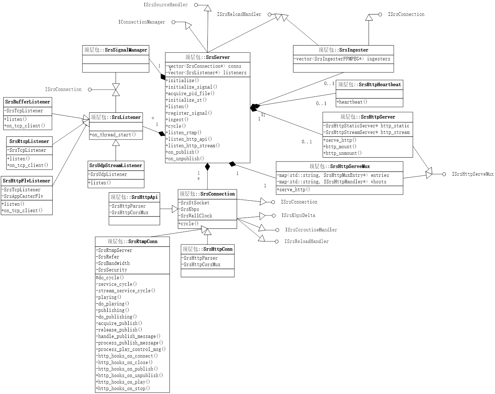
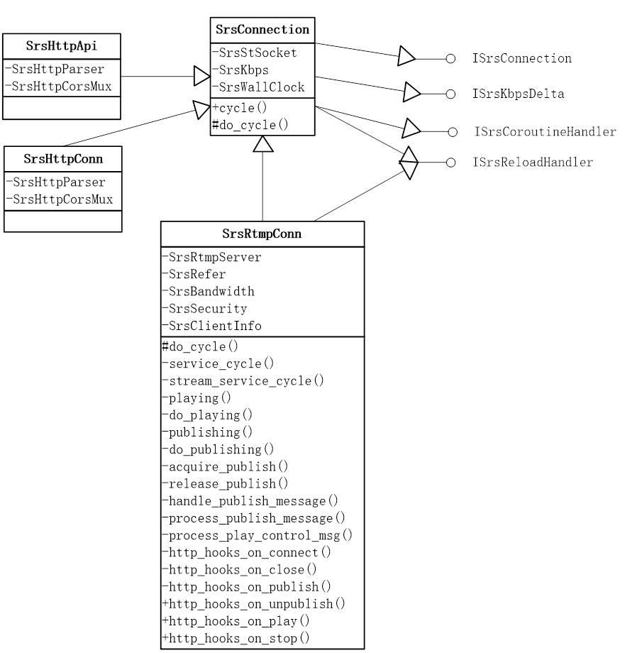
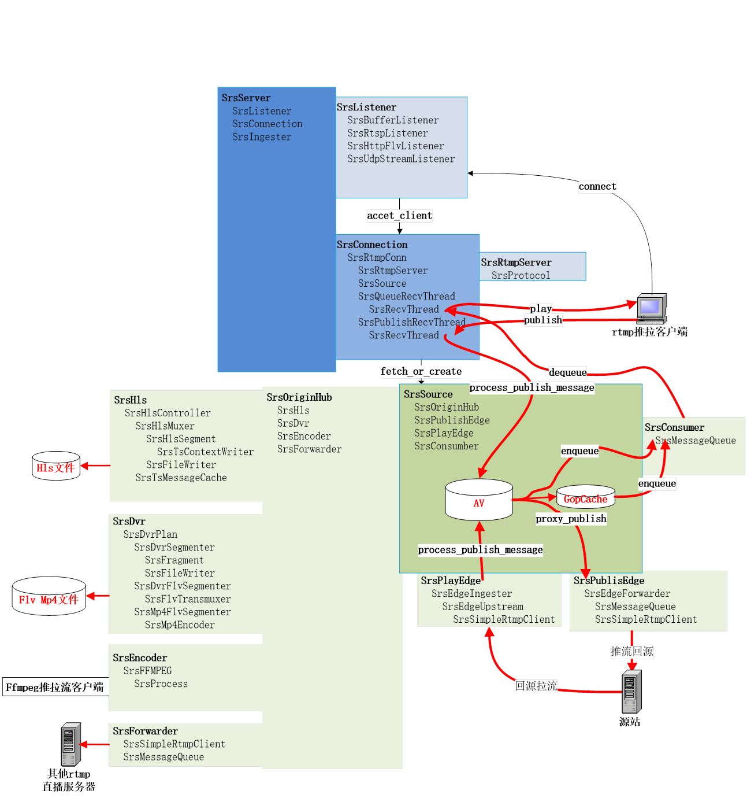
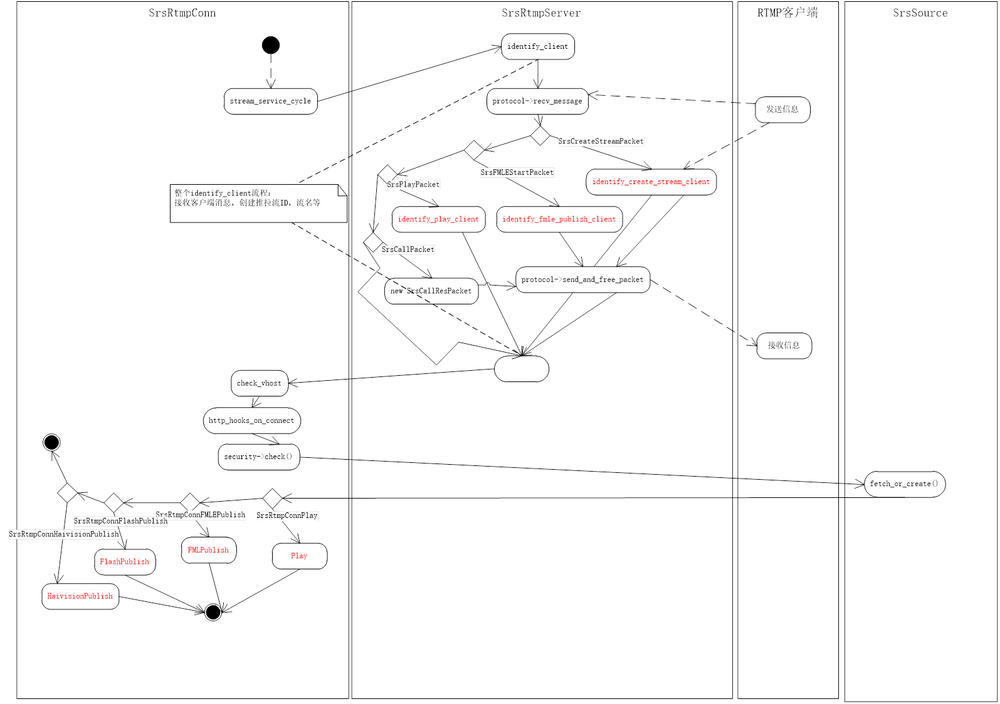

## SRS3.0源代码分析  
该文档根据阅读srs3.0源代码编写的代码分析笔记(v1.00)

#### 1 SRS简介  
#### 2 SRS架构  
   2.1 SRS系统架构  
   2.2 SRS模块结构  
   2.3 SRS媒体流发送架构  
#### 3 SRS类图  	
   3.1 类关系  
   3.2 SrsServer类   
   3.3 SrsConnection类  
   3.4 SrsSource类  
   3.5 SRS媒体流与类的关系   
#### 4 SRS线程架构  
   4.1 SRS通用线程模型  
   4.2 SRS内部线程结构  
#### 5 SRS程序流程 
   5.1 SRS启动流程     
   5.2 RTMP监听与连接流程     
   5.3 RTMP媒体流处理流程     
   5.4 RTMP推流流程     
   5.5 RTMP拉流流程   

#### 1 SRS简介  
官网简介: SRS定位是运营级的互联网直播服务器集群，追求更好的概念完整性和最简单实现的代码。SRS提供了丰富的接入方案将RTMP流接入SRS， 包括推送RTMP到SRS、推送RTSP/UDP/FLV到SRS、拉取流到SRS。 SRS还支持将接入的RTMP流进行各种变换，譬如将RTMP流转码、流截图、 转发给其他服务器、转封装成HTTP-FLV流、转封装成HLS、 转封装成HDS、录制成FLV/MP4。SRS包含支大规模集群如CDN业务的关键特性， 譬如RTMP多级集群、源站集群、VHOST虚拟服务器 、 无中断服务Reload、HTTP-FLV集群。此外，SRS还提供丰富的应用接口， 包括HTTP回调、安全策略Security、HTTP API接口、 RTMP测速。SRS在源站和CDN集群中都得到了广泛的应用Applications。
##### 官网源码仓库: https://github.com/ossrs/srs
##### 官网wiki: https://github.com/ossrs/srs/wiki
    
#### 2 SRS架构
##### 2.1 SRS系统架构
图片来自srs官网wiki

##### 2.2 SRS模块结构
图片来自srs官网wiki

##### 2.3 SRS模块结构
图片来自srs官网wiki

#### 3 SRS类图
##### 3.1 类关系

##### 3.2 SrsServer类

##### 3.3 SrsConnection类

##### 3.4 SrsSource类
...
##### 3.5 SRS媒体流与类的关系
   srs启动之后，客户端推拉流时，需要调用下面这些主要类来相互协作完成推拉流功能， 该流程描述媒体在srs主要类之间的静态流程。
 

1.	客户端发送rtmp连接请求，SrsListener收到connect请求后，创建一个SrsConnection，每个SrsConnection会启动一个线程来完成相应任务
2.	SrsRtmpConn首先按rtmp协议流程交互成功之后，根据请求url创建流名流类型等标启，同时调用fetch_or_create生成一个处理音视频源的SrsSource,，
##### 如果是推流：
创建SrsPublishRecvThread线程，接收客户端发送过来rtmp数据包，数据包由SrsRtmpServer来处理，如果是音视频数据，由process_publish_message来处理，它会通过SrsSource对媒体流的进行处理
1.	 如果该服务是边缘服务，SrsSource直接将媒体proxy publish到源站服务，
2.	 否则SrsSource会将publish流放入到每个SrsConsumer的媒体数据对列中,一个SrsConsumber就是一个播放客户端。同时调用SrsOriginHub将媒体流根据配置来生成flv,hls,mp4录相文件，以及是否将发布流转发到其他rtmp服务器等;最后检查如果启用GopCache会将媒体流写入GopCache对列中.用于当一个新的播放请求来时，保证首先能获取一个gop数据，以防播放开始时不黑屏或花屏
##### 如果拉流：
1.	如果是源站拉流同时启用源站集群，如果流不是该源站发布，则根据配置的发送api请求到其他源站，检查是否在其他源站发布了流，如果是，则发送一个redirect，要求拉流客户端重定向指定服务器拉流。注意rtmp重定向信令，如果客户端直接请求的源站，要求rtmp客户端支持redirect，如果srs边缘回源到源站后再重定向，那是没有问题的，因为srs边缘支持redirect
2.	如果不走第1步，则创建一个SrsConsumer与SrsQueueRecvThread线程, 创建SrsConsumer时，如果启用gopcache，首先会将gopcache媒体数据插入SrsConsumer的数据队列中。如果是边缘拉流，则使用SrsPlayEdge回源拉流。将回源拉的媒体流数据插入SrsConsumer的数据队列中
3.	SrsQueueRecvThread线程负责将SrsConsumer的数据队列中的媒体数据发送给客户端。SrsConsumer队列中数据来源于GopCache，源站publish的数据，以及回源拉流的数据

#### 4 SRS线程架构
##### 4.1 SRS通用线程模型
srs线程内部是使用协程库(State Threads)实现，
srs线程模型如下
 

##### 4.2 SRS内部线程结构
 

#### 5 SRS程序流程
##### 5.1 SRS启动流程
 

1.	首先检查解析启动命令参数，初始日志接口，检查配置文件是否正确
2.	创建SrsServer服务，初始化一些变量
3.	检查是否后台运行还是控制台运行
4.	初始化st 协程库，信息号管理器
5.	如果后台运行写进程pid到文件
6.	监听连接：
    listen_rtmp: rtmp推流或拉流连接
    listen_http_api: api请求连接
    listen_http_stream: http拉流连接,http-flv ,http-ts，http-aac，http-mp3
    listen_stream_caster: 接收MpegTSOverUdp流请求，rtsp推流请求，http-flv推流请求
7.	初始化http_api接口处理
8.	启动ingest协程，使用ffmpeg, 拉取文件或流转发到本服务
9.	启动主线程
              
##### 5.2 RTMP监听与连接流程
 

1.	SerServer调用listern启动rtmp监听线程
2.	客户端发送连接请求，监听线程收到请求后，发送on_tcp_accetpt()事件
3.	SrsrServer处理accetp_client() 创建一个新的SrsRtmpConn,同时启动SrsRtmpConnThread连接线程
4.	SrsRtmpConnThread收到客户端rtmp握手，同时根据rtmp连接流程创建一个rtmp连接
5.	连接成功之后,调用stream_service_cycle对rtmp媒体流处理

#### 5.3 RTMP媒体流处理流程
 

1.	identify_client 根据客户端请求类型创建流名，流Id，流类型（推拉流）等客户端标识信息
2.	check_vhost 根据配置检查域名是否合法
3.	http_hooks_on_connect 发送on_connect事件
4.	check检测根据配置检查是否允许推拉流
5.	根据请求创建或获取SrsSource对象
6.	根据流类型调用对应的推或拉流流程

#### 5.4 RTMP推流流程
 

1.	接收客户端发布流交互消息，start_fmle_publish完成发布流交互
2.	发送on_pulibsh事件
3.	SrsSource::can_publish 检查SrsSource流的是否已发布，如果是返回，不再发布
4.	检查是否边缘推流，如果是启动SrsEdgeForwarder线程，将流推向源站
5.	SrsSource::on_publish，如果配置flv,hls,mp4等，则开始录相，如配置转发，则启动转发线程
6.	启动SrsPublishRecvThread,线程，接收客户端数据，调用SrsRtmpConn::handle_publish_message处理数据
7.	SrsRtmpConn:::process_publish_message处理推流数据
8.	如果是边缘推流，将数据SrsEdgeForwarder对列，将数据发送到源站
9.	如是不是边缘推流，调用SrsSource相关方法处理音视频数据. 对hls,mp4,flv录相，转发，gopCache，以其放到SrsConsumber的消息对列中，
每个,SrsConsumber是一个播放客户端
10.	如果停止推流， SrsPublishRecvThread将stop退出线程， 
11.	调用on_edge_proxy_unpublish停止边缘推流线程
12.	SrsSource::on_unpublish,停止hls.,mp4,flv, 转发，清容gopCache
13.	http_hook_on_unpublish发送on_unpublish事件

#### 5.5 RTMP拉流流程

1.	SrsRtmpServer::start_play 根据rtmp协议 完成play流程
2.	SrsRtmpConn::http_hook_on_play 发送on_play事件，
3.	playing检查是否开启源站集群，如果是，且流没有在该源站发布，向其他源站发送请求，检查流在哪个源站发布，如果找到，重定向到该源站
4.	如是不是源站集群，create_consumer创建consumer，同时将gop缓冲数据放入consumer消息队列中，如果是边缘拉流，启动SrsEdgeIngester回源拉流
5.	recv_messae接收客户端信息,放下consumer消息对列中， pump从队列获取消息，process_play_control_msg处理rtmp控制消息
6.	dump_packets从consumber的消息队列中获取媒体数据， send_and_free_message 发送给给客户端
7.	stop停止播， http_hook_on_stop发送on_stop事件

