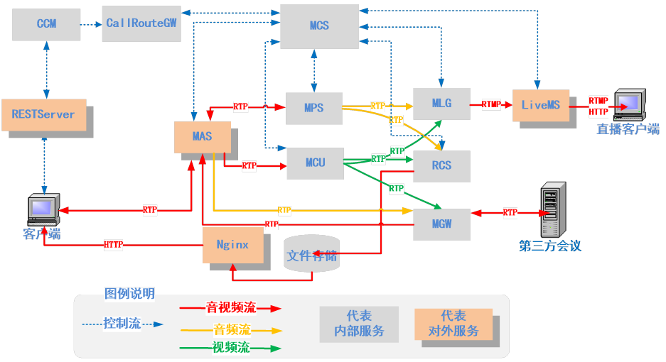
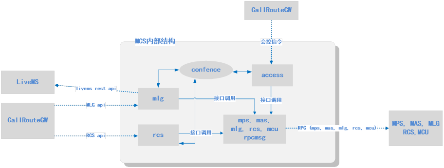
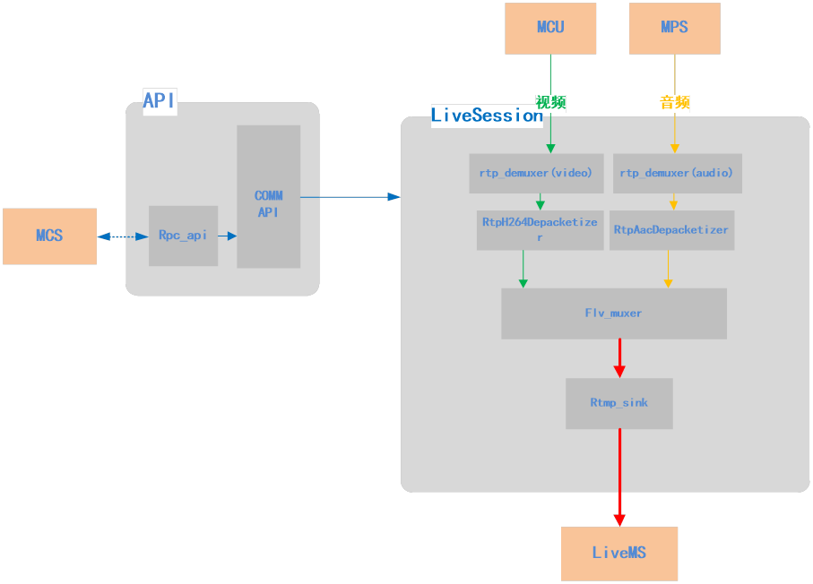
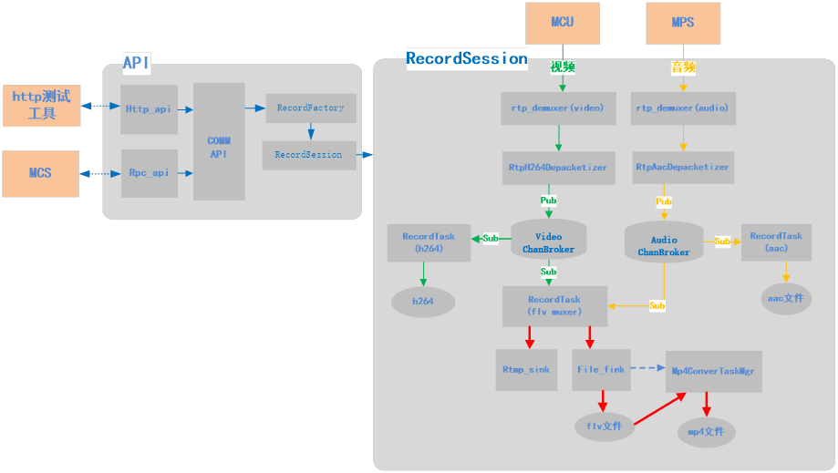
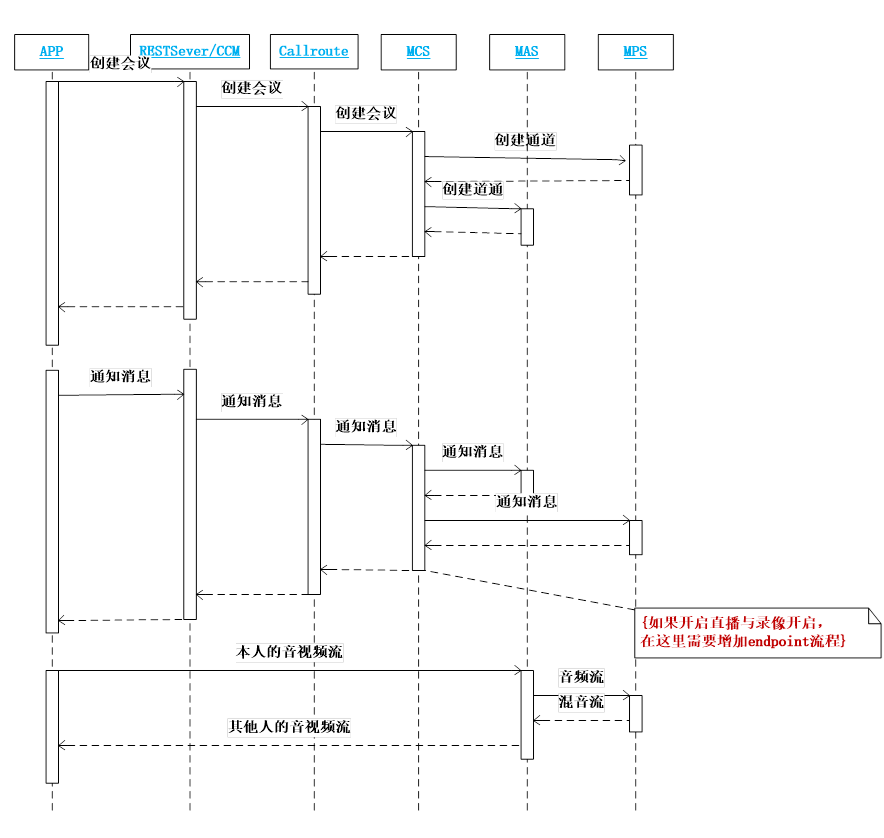
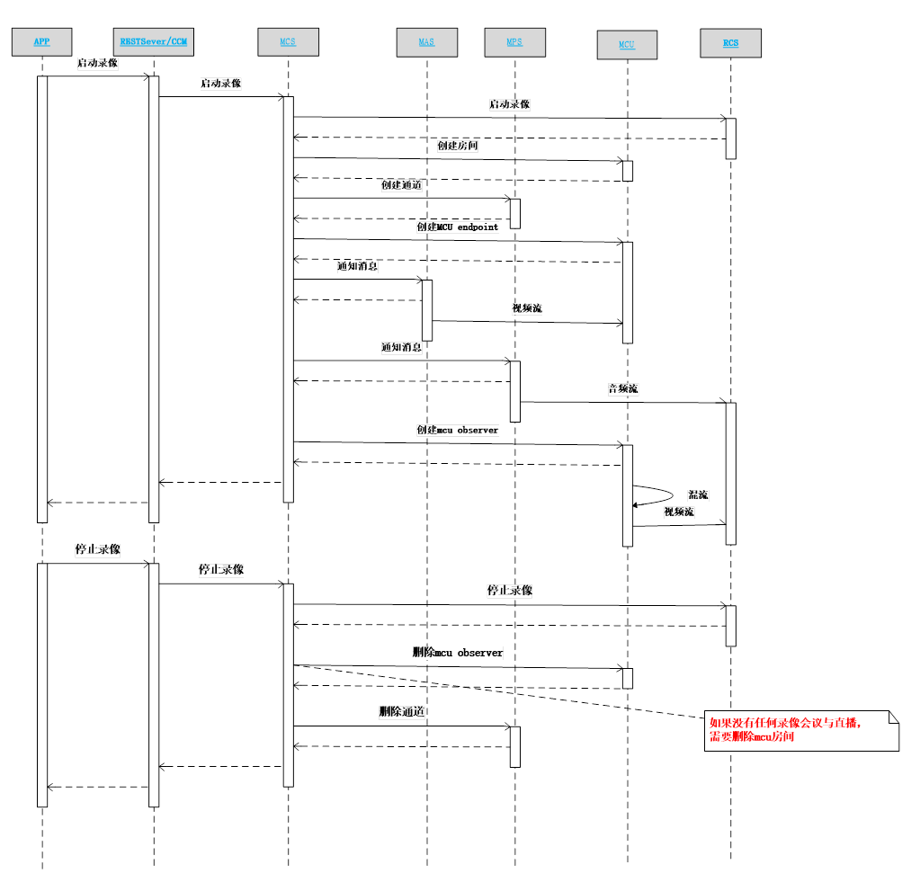
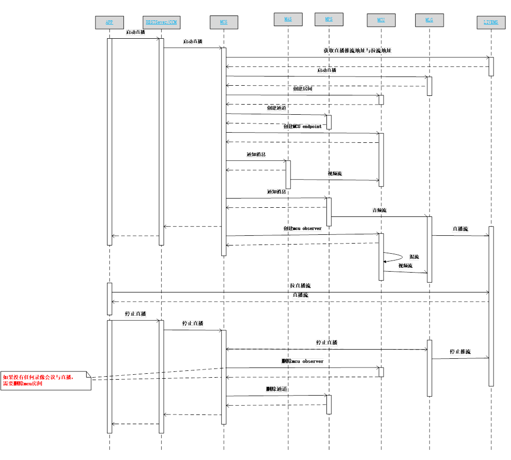
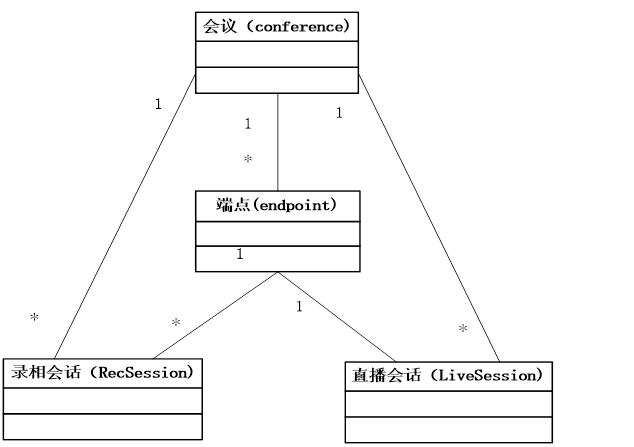

<html>

<head>
<meta http-equiv=Content-Type content="text/html; charset=gb2312">
<meta name=Generator content="Microsoft Word 15 (filtered)">
<title>会议录像与直播重构方案设计</title>

</head>

<body lang=ZH-CN link="#0563C1" vlink="#954F72" style='text-justify-trim:punctuation'>

<b> 
</b>

<h1><a name="_Toc37241775">会议直播与录相方案设计</a></h1>

<b>&nbsp;</b>

目录

<a
href="#_Toc37241775">会议直播与录相方案设计... 0</a>

<a
href="#_Toc37241776">需求... 0</a>

<a
href="#_Toc37241777">产品功能... 0</a>

<a
href="#_Toc37241778">功能性需求... 0</a>

<a
href="#_Toc37241779">会议直播... 0</a>

<a
href="#_Toc37241780">会议录像... 0</a>

<a
href="#_Toc37241781">非功能性需求... 0</a>

<a
href="#_Toc37241782">产品使用场景... 0</a>

<a
href="#_Toc37241783">系统设计... 0</a>

<a
href="#_Toc37241784">架构设计... 0</a>

<a
href="#_Toc37241785">会议总体架构(非集群) 0</a>

<a
href="#_Toc37241786">功能模块设计... 0</a>

<a
href="#_Toc37241787">MCS的内部结构... 0</a>

<a
href="#_Toc37241788">RCS与MLG内部结构... 0</a>

<a
href="#_Toc37241789">模块消息交互与流程... 0</a>

<a
href="#_Toc37241790">会议录像基本流程... 0</a>

<a
href="#_Toc37241791">会议直播基本流程... 0</a>

<a
href="#_Toc37241792">同时开始录像与直播流程... 0</a>

<a
href="#_Toc37241793">同时直播与录像时，先停止直播流程... 0</a>

<a
href="#_Toc37241794">在已有直播上切换屏幕共享直播流程... 0</a>

<a
href="#_Toc37241795">直接开启屏幕共享直播流程... 0</a>

<a
href="#_Toc37241796">一个会议同时有两个或以上直播或录像流程... 0</a>

<a
href="#_Toc37241797">多人自动模式添加，删除成员流程... 0</a>

<a
href="#_Toc37241798">多人自动模式手动模式切换流程... 0</a>

<a
href="#_Toc37241799">第三方会议接入流程... 0</a>

<a
href="#_Toc37241800">数据结构设计... 0</a>

<a
href="#_Toc37241801">会议录像与直播实体关联图... 0</a>

<a
href="#_Toc37241802">会议实体信息... 0</a>

<a
href="#_Toc37241803">会议成员信息... 0</a>

<a
href="#_Toc37241804">录像会话... 0</a>

<a
href="#_Toc37241805">录像文件列表... 0</a>

<a
href="#_Toc37241806">直播会话... 0</a>

<a
href="#_Toc37241807">系统测试... 0</a>

<a
href="#_Toc37241808">测试用例... 0</a>

&nbsp;

<b>&nbsp;</b>

<b>&nbsp;</b>

<b>&nbsp;</b>

<h1><a name="_Toc37241776">需求</a></h1>

在使用实时音视频的过程中，经常会有两种情况，一是需要将音视频通话，会议的全过程录像，方便过后回看以及相应处理。如重要会议需要事后回看学习，等等;另外一种是通话或会议时，需要将全过程对外发布，让更多不在现场的人在第一时间能了解到会议实时情况，所以需要将其广播出去。也就是将会议直播出去。如在线教育，直播连麦等等。

从上面的需求可以归类成两个最基本功能，就是会议录像与直播，针对这两个功能，在一些现实中会在这两个基本需求的基础上，来满足不同应用场景。为了让系统能很好适应这些些场景，下面从功能性或非功能性方面详细细化这两大基础功能。

我们会议系统现在部分功能都已经实现，但随着业务，应用场景的不段变化，现在方案实现，越来越复杂，有新需求变更时，实现也越来越来麻烦。为了解决目前这些问题，需要对会议直播与录像进行重构，以更好方式来完成已有业务功能，以及更容易适应新的需求变更。

<h1><a name="_Toc37241777">产品功能</a></h1>

<h2><a name="_Toc37241778">功能性需求</a></h2>

<table class=MsoTable15Grid4Accent5 border=1 cellspacing=0 cellpadding=0
 width=491 style='width:368.3pt;border-collapse:collapse;border:none'>
 <tr style='height:14.25pt'>
  <td width=96 nowrap valign=top style='width:72.0pt;border:solid #5B9BD5 1.0pt;
  border-right:none;background:#5B9BD5;padding:0cm 5.4pt 0cm 5.4pt;height:14.25pt'>
  
<b>功能顶</b>

  </td>
  <td width=225 nowrap valign=top style='width:168.75pt;border-top:solid #5B9BD5 1.0pt;
  border-left:none;border-bottom:solid #5B9BD5 1.0pt;border-right:none;
  background:#5B9BD5;padding:0cm 5.4pt 0cm 5.4pt;height:14.25pt'>
  
<b>功能点</b>

  </td>
  <td width=83 nowrap colspan=2 valign=top style='width:62.25pt;border-top:
  solid #5B9BD5 1.0pt;border-left:none;border-bottom:solid #5B9BD5 1.0pt;
  border-right:none;background:#5B9BD5;padding:0cm 5.4pt 0cm 5.4pt;height:14.25pt'>
  
<b>功能级别</b>

  </td>
  <td width=87 nowrap valign=top style='width:65.3pt;border:solid #5B9BD5 1.0pt;
  border-left:none;background:#5B9BD5;padding:0cm 5.4pt 0cm 5.4pt;height:14.25pt'>
  
<b>选顶</b>

  </td>
 </tr>
 <tr style='height:14.25pt'>
  <td width=96 nowrap rowspan=8 valign=top style='width:72.0pt;border:solid #9CC2E5 1.0pt;
  border-top:none;background:#DEEAF6;padding:0cm 5.4pt 0cm 5.4pt;height:14.25pt'>
  
会议直播

  </td>
  <td width=236 nowrap colspan=2 valign=top style='width:177.0pt;border-top:
  none;border-left:none;border-bottom:solid #9CC2E5 1.0pt;border-right:solid #9CC2E5 1.0pt;
  background:#DEEAF6;padding:0cm 5.4pt 0cm 5.4pt;height:14.25pt'>
  
多人单人直播

  </td>
  <td width=72 nowrap valign=top style='width:54.0pt;border-top:none;
  border-left:none;border-bottom:solid #9CC2E5 1.0pt;border-right:solid #9CC2E5 1.0pt;
  background:#DEEAF6;padding:0cm 5.4pt 0cm 5.4pt;height:14.25pt'>
  
高

  </td>
  <td width=87 nowrap valign=top style='width:65.3pt;border-top:none;
  border-left:none;border-bottom:solid #9CC2E5 1.0pt;border-right:solid #9CC2E5 1.0pt;
  background:#DEEAF6;padding:0cm 5.4pt 0cm 5.4pt;height:14.25pt'>
  
必选

  </td>
 </tr>
 <tr style='height:42.75pt'>
  <td width=236 nowrap colspan=2 valign=top style='width:177.0pt;border-top:
  none;border-left:none;border-bottom:solid #9CC2E5 1.0pt;border-right:solid #9CC2E5 1.0pt;
  padding:0cm 5.4pt 0cm 5.4pt;height:42.75pt'>
  
同会议可输出多个直播

  </td>
  <td width=72 nowrap valign=top style='width:54.0pt;border-top:none;
  border-left:none;border-bottom:solid #9CC2E5 1.0pt;border-right:solid #9CC2E5 1.0pt;
  padding:0cm 5.4pt 0cm 5.4pt;height:42.75pt'>
  
高

  </td>
  <td width=87 nowrap valign=top style='width:65.3pt;border-top:none;
  border-left:none;border-bottom:solid #9CC2E5 1.0pt;border-right:solid #9CC2E5 1.0pt;
  padding:0cm 5.4pt 0cm 5.4pt;height:42.75pt'>
  
必选

  </td>
 </tr>
 <tr style='height:36.75pt'>
  <td width=236 nowrap colspan=2 valign=top style='width:177.0pt;border-top:
  none;border-left:none;border-bottom:solid #9CC2E5 1.0pt;border-right:solid #9CC2E5 1.0pt;
  background:#DEEAF6;padding:0cm 5.4pt 0cm 5.4pt;height:36.75pt'>
  
屏幕共享直播

  </td>
  <td width=72 nowrap valign=top style='width:54.0pt;border-top:none;
  border-left:none;border-bottom:solid #9CC2E5 1.0pt;border-right:solid #9CC2E5 1.0pt;
  background:#DEEAF6;padding:0cm 5.4pt 0cm 5.4pt;height:36.75pt'>
  
高

  </td>
  <td width=87 nowrap valign=top style='width:65.3pt;border-top:none;
  border-left:none;border-bottom:solid #9CC2E5 1.0pt;border-right:solid #9CC2E5 1.0pt;
  background:#DEEAF6;padding:0cm 5.4pt 0cm 5.4pt;height:36.75pt'>
  
必选

  </td>
 </tr>
 <tr style='height:14.25pt'>
  <td width=236 nowrap colspan=2 valign=top style='width:177.0pt;border-top:
  none;border-left:none;border-bottom:solid #9CC2E5 1.0pt;border-right:solid #9CC2E5 1.0pt;
  padding:0cm 5.4pt 0cm 5.4pt;height:14.25pt'>
  
输出布局指定

  </td>
  <td width=72 nowrap valign=top style='width:54.0pt;border-top:none;
  border-left:none;border-bottom:solid #9CC2E5 1.0pt;border-right:solid #9CC2E5 1.0pt;
  padding:0cm 5.4pt 0cm 5.4pt;height:14.25pt'>
  
高

  </td>
  <td width=87 nowrap valign=top style='width:65.3pt;border-top:none;
  border-left:none;border-bottom:solid #9CC2E5 1.0pt;border-right:solid #9CC2E5 1.0pt;
  padding:0cm 5.4pt 0cm 5.4pt;height:14.25pt'>
  
必选

  </td>
 </tr>
 <tr style='height:23.25pt'>
  <td width=236 nowrap colspan=2 valign=top style='width:177.0pt;border-top:
  none;border-left:none;border-bottom:solid #9CC2E5 1.0pt;border-right:solid #9CC2E5 1.0pt;
  background:#DEEAF6;padding:0cm 5.4pt 0cm 5.4pt;height:23.25pt'>
  
直播启停控制

  </td>
  <td width=72 nowrap valign=top style='width:54.0pt;border-top:none;
  border-left:none;border-bottom:solid #9CC2E5 1.0pt;border-right:solid #9CC2E5 1.0pt;
  background:#DEEAF6;padding:0cm 5.4pt 0cm 5.4pt;height:23.25pt'>
  
高

  </td>
  <td width=87 nowrap valign=top style='width:65.3pt;border-top:none;
  border-left:none;border-bottom:solid #9CC2E5 1.0pt;border-right:solid #9CC2E5 1.0pt;
  background:#DEEAF6;padding:0cm 5.4pt 0cm 5.4pt;height:23.25pt'>
  
必选

  </td>
 </tr>
 <tr style='height:19.5pt'>
  <td width=236 nowrap colspan=2 valign=top style='width:177.0pt;border-top:
  none;border-left:none;border-bottom:solid #9CC2E5 1.0pt;border-right:solid #9CC2E5 1.0pt;
  padding:0cm 5.4pt 0cm 5.4pt;height:19.5pt'>
  
人离开画面，暂停直播

  </td>
  <td width=72 nowrap valign=top style='width:54.0pt;border-top:none;
  border-left:none;border-bottom:solid #9CC2E5 1.0pt;border-right:solid #9CC2E5 1.0pt;
  padding:0cm 5.4pt 0cm 5.4pt;height:19.5pt'>
  
低

  </td>
  <td width=87 nowrap valign=top style='width:65.3pt;border-top:none;
  border-left:none;border-bottom:solid #9CC2E5 1.0pt;border-right:solid #9CC2E5 1.0pt;
  padding:0cm 5.4pt 0cm 5.4pt;height:19.5pt'>
  
可选 

  </td>
 </tr>
 <tr style='height:19.5pt'>
  <td width=236 nowrap colspan=2 valign=top style='width:177.0pt;border-top:
  none;border-left:none;border-bottom:solid #9CC2E5 1.0pt;border-right:solid #9CC2E5 1.0pt;
  background:#DEEAF6;padding:0cm 5.4pt 0cm 5.4pt;height:19.5pt'>
  
两个会议主播混屏

  </td>
  <td width=72 nowrap valign=top style='width:54.0pt;border-top:none;
  border-left:none;border-bottom:solid #9CC2E5 1.0pt;border-right:solid #9CC2E5 1.0pt;
  background:#DEEAF6;padding:0cm 5.4pt 0cm 5.4pt;height:19.5pt'>
  
低

  </td>
  <td width=87 nowrap valign=top style='width:65.3pt;border-top:none;
  border-left:none;border-bottom:solid #9CC2E5 1.0pt;border-right:solid #9CC2E5 1.0pt;
  background:#DEEAF6;padding:0cm 5.4pt 0cm 5.4pt;height:19.5pt'>
  
可选 

  </td>
 </tr>
 <tr style='height:14.25pt'>
  <td width=236 nowrap colspan=2 valign=top style='width:177.0pt;border-top:
  none;border-left:none;border-bottom:solid #9CC2E5 1.0pt;border-right:solid #9CC2E5 1.0pt;
  padding:0cm 5.4pt 0cm 5.4pt;height:14.25pt'>
  
只输出音频或视频

  </td>
  <td width=72 nowrap valign=top style='width:54.0pt;border-top:none;
  border-left:none;border-bottom:solid #9CC2E5 1.0pt;border-right:solid #9CC2E5 1.0pt;
  padding:0cm 5.4pt 0cm 5.4pt;height:14.25pt'>
  
高

  </td>
  <td width=87 nowrap valign=top style='width:65.3pt;border-top:none;
  border-left:none;border-bottom:solid #9CC2E5 1.0pt;border-right:solid #9CC2E5 1.0pt;
  padding:0cm 5.4pt 0cm 5.4pt;height:14.25pt'>
  
必选

  </td>
 </tr>
 <tr style='height:14.25pt'>
  <td width=96 nowrap rowspan=5 valign=top style='width:72.0pt;border:solid #9CC2E5 1.0pt;
  border-top:none;background:#DEEAF6;padding:0cm 5.4pt 0cm 5.4pt;height:14.25pt'>
  
会议录像

  </td>
  <td width=236 nowrap colspan=2 valign=top style='width:177.0pt;border-top:
  none;border-left:none;border-bottom:solid #9CC2E5 1.0pt;border-right:solid #9CC2E5 1.0pt;
  background:#DEEAF6;padding:0cm 5.4pt 0cm 5.4pt;height:14.25pt'>
  
支持以上会议直播同样功能

  </td>
  <td width=72 nowrap valign=top style='width:54.0pt;border-top:none;
  border-left:none;border-bottom:solid #9CC2E5 1.0pt;border-right:solid #9CC2E5 1.0pt;
  background:#DEEAF6;padding:0cm 5.4pt 0cm 5.4pt;height:14.25pt'>
  
高

  </td>
  <td width=87 nowrap valign=top style='width:65.3pt;border-top:none;
  border-left:none;border-bottom:solid #9CC2E5 1.0pt;border-right:solid #9CC2E5 1.0pt;
  background:#DEEAF6;padding:0cm 5.4pt 0cm 5.4pt;height:14.25pt'>
  
必选

  </td>
 </tr>
 <tr style='height:14.25pt'>
  <td width=236 nowrap colspan=2 valign=top style='width:177.0pt;border-top:
  none;border-left:none;border-bottom:solid #9CC2E5 1.0pt;border-right:solid #9CC2E5 1.0pt;
  padding:0cm 5.4pt 0cm 5.4pt;height:14.25pt'>
  
录像文件支持mp4,flv等

  </td>
  <td width=72 nowrap valign=top style='width:54.0pt;border-top:none;
  border-left:none;border-bottom:solid #9CC2E5 1.0pt;border-right:solid #9CC2E5 1.0pt;
  padding:0cm 5.4pt 0cm 5.4pt;height:14.25pt'>
  
高

  </td>
  <td width=87 nowrap valign=top style='width:65.3pt;border-top:none;
  border-left:none;border-bottom:solid #9CC2E5 1.0pt;border-right:solid #9CC2E5 1.0pt;
  padding:0cm 5.4pt 0cm 5.4pt;height:14.25pt'>
  
必选

  </td>
 </tr>
 <tr style='height:14.25pt'>
  <td width=236 nowrap colspan=2 valign=top style='width:177.0pt;border-top:
  none;border-left:none;border-bottom:solid #9CC2E5 1.0pt;border-right:solid #9CC2E5 1.0pt;
  background:#DEEAF6;padding:0cm 5.4pt 0cm 5.4pt;height:14.25pt'>
  
支持录像h264��流与aac��流文件

  </td>
  <td width=72 nowrap valign=top style='width:54.0pt;border-top:none;
  border-left:none;border-bottom:solid #9CC2E5 1.0pt;border-right:solid #9CC2E5 1.0pt;
  background:#DEEAF6;padding:0cm 5.4pt 0cm 5.4pt;height:14.25pt'>
  
中

  </td>
  <td width=87 nowrap valign=top style='width:65.3pt;border-top:none;
  border-left:none;border-bottom:solid #9CC2E5 1.0pt;border-right:solid #9CC2E5 1.0pt;
  background:#DEEAF6;padding:0cm 5.4pt 0cm 5.4pt;height:14.25pt'>
  
可选

  </td>
 </tr>
 <tr style='height:14.25pt'>
  <td width=236 nowrap colspan=2 valign=top style='width:177.0pt;border-top:
  none;border-left:none;border-bottom:solid #9CC2E5 1.0pt;border-right:solid #9CC2E5 1.0pt;
  padding:0cm 5.4pt 0cm 5.4pt;height:14.25pt'>
  
录像能指定输出的分辨率大小等

  </td>
  <td width=72 nowrap valign=top style='width:54.0pt;border-top:none;
  border-left:none;border-bottom:solid #9CC2E5 1.0pt;border-right:solid #9CC2E5 1.0pt;
  padding:0cm 5.4pt 0cm 5.4pt;height:14.25pt'>
  
中

  </td>
  <td width=87 nowrap valign=top style='width:65.3pt;border-top:none;
  border-left:none;border-bottom:solid #9CC2E5 1.0pt;border-right:solid #9CC2E5 1.0pt;
  padding:0cm 5.4pt 0cm 5.4pt;height:14.25pt'>
  
必选

  </td>
 </tr>
 <tr style='height:17.2pt'>
  <td width=236 nowrap colspan=2 valign=top style='width:177.0pt;border-top:
  none;border-left:none;border-bottom:solid #9CC2E5 1.0pt;border-right:solid #9CC2E5 1.0pt;
  background:#DEEAF6;padding:0cm 5.4pt 0cm 5.4pt;height:17.2pt'>
  
支持截图jpg

  </td>
  <td width=72 nowrap valign=top style='width:54.0pt;border-top:none;
  border-left:none;border-bottom:solid #9CC2E5 1.0pt;border-right:solid #9CC2E5 1.0pt;
  background:#DEEAF6;padding:0cm 5.4pt 0cm 5.4pt;height:17.2pt'>
  
中

  </td>
  <td width=87 nowrap valign=top style='width:65.3pt;border-top:none;
  border-left:none;border-bottom:solid #9CC2E5 1.0pt;border-right:solid #9CC2E5 1.0pt;
  background:#DEEAF6;padding:0cm 5.4pt 0cm 5.4pt;height:17.2pt'>
  
可选

  </td>
 </tr>
 <tr height=0>
  <td width=96 style='border:none'></td>
  <td width=225 style='border:none'></td>
  <td width=11 style='border:none'></td>
  <td width=72 style='border:none'></td>
  <td width=87 style='border:none'></td>
 </tr>
</table>

&nbsp;

<h3><a name="_Toc37241779">会议直播</a></h3>

<h4>多人单人直播</h4>

可以把会议的单人成员的音视频输出直播，多人混屏输出直播

<h4>同会议可输出多个直播</h4>

&nbsp;&nbsp;&nbsp;&nbsp;&nbsp;&nbsp; 同会议所有成员，可以任一组合，输出到多个直播，也就是多对一，如会议成员1,2,3 4&nbsp;&nbsp; 如1，2输出直播频道1， 【2，3】输出到直播2 ， 【1，2，3，4】输出到直播3

<h4>屏幕共享直播</h4>

每个成员都可以有屏幕共享输出，需要确定会议的成员视频与该成员的共享屏幕是否同时输出, 屏幕共享与成员视频，可指定任一输出，还是二者都可以

<h4>输出布局指定</h4>

输出时可以指定屏幕的布局，需要确定最大人数，也需要考虑横屏与竖屏，剪栽模式，画面黑边处理

&nbsp;

<h4>直播启停控制</h4>

会议在直播中，每个成员加入或退出需要自动加入或退出直播，所有人退出，自动停止所有直播

<h4>人离开画面，暂停直播</h4>

会议直播中，画面中人离开，需要自动停止直播，该功能需要依赖AI目标检查功能

<h4>两个会议主播混屏</h4>

旁路直播中，两个主播pk画面

<h4>只输出音频或视频</h4>

只输出音频或视频

<h3><a name="_Toc37241780">会议录像</a></h3>

<h4>录像文件支持mp4,flv</h4>

录像支持flv与mp4, 需要考虑单个会议文件的时长，是否需要考虑分割成多个文件

<h4>支持录像h264��流与aac��流文件</h4>

可以将输出单独录像成h264,aac��流

&nbsp;

<h2><a name="_Toc37241781">非功能性需求</a></h2>

<table class=MsoTable15Grid4Accent1 border=1 cellspacing=0 cellpadding=0
 width=509 style='width:382.0pt;border-collapse:collapse;border:none'>
 <tr style='height:14.25pt'>
  <td width=96 nowrap valign=top style='width:72.0pt;border:solid #4472C4 1.0pt;
  border-right:none;background:#4472C4;padding:0cm 5.4pt 0cm 5.4pt;height:14.25pt'>
  
<b>功能顶</b>

  </td>
  <td width=236 nowrap valign=top style='width:177.0pt;border-top:solid #4472C4 1.0pt;
  border-left:none;border-bottom:solid #4472C4 1.0pt;border-right:none;
  background:#4472C4;padding:0cm 5.4pt 0cm 5.4pt;height:14.25pt'>
  
<b>功能点</b>

  </td>
  <td width=83 nowrap valign=top style='width:62.6pt;border-top:solid #4472C4 1.0pt;
  border-left:none;border-bottom:solid #4472C4 1.0pt;border-right:none;
  background:#4472C4;padding:0cm 5.4pt 0cm 5.4pt;height:14.25pt'>
  
<b>功能级别</b>

  </td>
  <td width=94 nowrap valign=top style='width:70.4pt;border:solid #4472C4 1.0pt;
  border-left:none;background:#4472C4;padding:0cm 5.4pt 0cm 5.4pt;height:14.25pt'>
  
<b>选顶</b>

  </td>
 </tr>
 <tr style='height:35.25pt'>
  <td width=96 rowspan=3 valign=top style='width:72.0pt;border:solid #8EAADB 1.0pt;
  border-top:none;background:#D9E2F3;padding:0cm 5.4pt 0cm 5.4pt;height:35.25pt'>
  
<b>会议录像与直播</b>

  </td>
  <td width=236 valign=top style='width:177.0pt;border-top:none;border-left:
  none;border-bottom:solid #8EAADB 1.0pt;border-right:solid #8EAADB 1.0pt;
  background:#D9E2F3;padding:0cm 5.4pt 0cm 5.4pt;height:35.25pt'>
  
1.一个会议最大支持人数，会议直播与录像的输入，输出数

  </td>
  <td width=83 nowrap valign=top style='width:62.6pt;border-top:none;
  border-left:none;border-bottom:solid #8EAADB 1.0pt;border-right:solid #8EAADB 1.0pt;
  background:#D9E2F3;padding:0cm 5.4pt 0cm 5.4pt;height:35.25pt'>
  
高

  </td>
  <td width=94 nowrap valign=top style='width:70.4pt;border-top:none;
  border-left:none;border-bottom:solid #8EAADB 1.0pt;border-right:solid #8EAADB 1.0pt;
  background:#D9E2F3;padding:0cm 5.4pt 0cm 5.4pt;height:35.25pt'>
  
必选

  </td>
 </tr>
 <tr style='height:20.25pt'>
  <td width=236 nowrap valign=top style='width:177.0pt;border-top:none;
  border-left:none;border-bottom:solid #8EAADB 1.0pt;border-right:solid #8EAADB 1.0pt;
  padding:0cm 5.4pt 0cm 5.4pt;height:20.25pt'>
  
2.会议直播的最大延迟

  </td>
  <td width=83 nowrap valign=top style='width:62.6pt;border-top:none;
  border-left:none;border-bottom:solid #8EAADB 1.0pt;border-right:solid #8EAADB 1.0pt;
  padding:0cm 5.4pt 0cm 5.4pt;height:20.25pt'>
  
高

  </td>
  <td width=94 nowrap valign=top style='width:70.4pt;border-top:none;
  border-left:none;border-bottom:solid #8EAADB 1.0pt;border-right:solid #8EAADB 1.0pt;
  padding:0cm 5.4pt 0cm 5.4pt;height:20.25pt'>
  
必选

  </td>
 </tr>
 <tr style='height:21.75pt'>
  <td width=236 nowrap valign=top style='width:177.0pt;border-top:none;
  border-left:none;border-bottom:solid #8EAADB 1.0pt;border-right:solid #8EAADB 1.0pt;
  background:#D9E2F3;padding:0cm 5.4pt 0cm 5.4pt;height:21.75pt'>
  
3.录像与直播画面的连续性

  </td>
  <td width=83 nowrap valign=top style='width:62.6pt;border-top:none;
  border-left:none;border-bottom:solid #8EAADB 1.0pt;border-right:solid #8EAADB 1.0pt;
  background:#D9E2F3;padding:0cm 5.4pt 0cm 5.4pt;height:21.75pt'>
  
高

  </td>
  <td width=94 nowrap valign=top style='width:70.4pt;border-top:none;
  border-left:none;border-bottom:solid #8EAADB 1.0pt;border-right:solid #8EAADB 1.0pt;
  background:#D9E2F3;padding:0cm 5.4pt 0cm 5.4pt;height:21.75pt'>
  
必选

  </td>
 </tr>
</table>

&nbsp;

<b>1.</b><b>一个会议最大支持人数，会议直播与录像的输入，输出数</b>

会议人数，是指与参加会议的实际人数; 输入数是指需要录像或直播的人数，输出数是

向直播推流的频道数与录像输出的个数之后

<b>2.</b><b> </b><b>会议直播的最大延迟</b>

&nbsp;&nbsp;&nbsp;
会议的视频与直播后的视频最大允许的延迟

<b>3.</b><b> </b><b>录像与直播画面的连续性</b>

<b>&nbsp;&nbsp; </b>&nbsp;画面花屏，或卡顿的次数，在直播或录像过程有可能网络掉线后马上恢复

<h1><a name="_Toc37241782">产品使用场景</a></h1>

<table class=MsoNormalTable border=0 cellspacing=0 cellpadding=0 width=575
 style='width:431.0pt;border-collapse:collapse'>
 <tr style='height:14.25pt'>
  <td width=575 nowrap valign=bottom style='width:431.0pt;padding:0cm 5.4pt 0cm 5.4pt;
  height:14.25pt'>
  
1.&nbsp;&nbsp;&nbsp; 创建会议，开始直播，中间有人加入会议，有人退出会议

  </td>
 </tr>
 <tr style='height:14.25pt'>
  <td width=575 nowrap valign=bottom style='width:431.0pt;padding:0cm 5.4pt 0cm 5.4pt;
  height:14.25pt'>
  
2.&nbsp;&nbsp;&nbsp; 创建会议，多人在开会中，现在还没有直播，在某个时候，需要开始直播

  </td>
 </tr>
 <tr style='height:14.25pt'>
  <td width=575 nowrap valign=bottom style='width:431.0pt;padding:0cm 5.4pt 0cm 5.4pt;
  height:14.25pt'>
  
3.&nbsp;&nbsp;&nbsp; 会议还没有开始，尝试开启直播

  </td>
 </tr>
 <tr style='height:14.25pt'>
  <td width=575 nowrap valign=bottom style='width:431.0pt;padding:0cm 5.4pt 0cm 5.4pt;
  height:14.25pt'>
  
4.&nbsp;&nbsp;&nbsp; 会议开始后，想看某人的直播

  </td>
 </tr>
 <tr style='height:14.25pt'>
  <td width=575 nowrap valign=bottom style='width:431.0pt;padding:0cm 5.4pt 0cm 5.4pt;
  height:14.25pt'>
  
5.&nbsp;&nbsp;&nbsp; 会议开始后，想看多人的混屏直播

  </td>
 </tr>
 <tr style='height:14.25pt'>
  <td width=575 nowrap valign=bottom style='width:431.0pt;padding:0cm 5.4pt 0cm 5.4pt;
  height:14.25pt'>
  
6.&nbsp;&nbsp;&nbsp; 想看某人的共享屏幕，同时想看该人的成员视频

  </td>
 </tr>
 <tr style='height:14.25pt'>
  <td width=575 nowrap valign=bottom style='width:431.0pt;padding:0cm 5.4pt 0cm 5.4pt;
  height:14.25pt'>
  
7.&nbsp;&nbsp;&nbsp; 想把直播输出的画面，同时也能回看录像

  </td>
 </tr>
 <tr style='height:14.25pt'>
  <td width=575 nowrap valign=bottom style='width:431.0pt;padding:0cm 5.4pt 0cm 5.4pt;
  height:14.25pt'>
  
8.&nbsp;&nbsp;&nbsp; 我现在正在看共享屏幕，突然我想看成员的视频， 反之，也一样

  </td>
 </tr>
 <tr style='height:14.25pt'>
  <td width=575 nowrap valign=bottom style='width:431.0pt;padding:0cm 5.4pt 0cm 5.4pt;
  height:14.25pt'>
  
9.&nbsp;&nbsp;&nbsp; 我想看多人的的共享屏幕

  </td>
 </tr>
 <tr style='height:14.25pt'>
  <td width=575 nowrap valign=bottom style='width:431.0pt;padding:0cm 5.4pt 0cm 5.4pt;
  height:14.25pt'>
  
10.我只需要会议中某人的音频或视频，

  </td>
 </tr>
 <tr style='height:14.25pt'>
  <td width=575 nowrap valign=bottom style='width:431.0pt;padding:0cm 5.4pt 0cm 5.4pt;
  height:14.25pt'>
  
11.我需要会议中某画面中的图片文件

  </td>
 </tr>
 <tr style='height:14.25pt'>
  <td width=575 nowrap valign=bottom style='width:431.0pt;padding:0cm 5.4pt 0cm 5.4pt;
  height:14.25pt'>
  
12.我想在某个时候开始直播与录像

  </td>
 </tr>
 <tr style='height:14.25pt'>
  <td width=575 nowrap valign=bottom style='width:431.0pt;padding:0cm 5.4pt 0cm 5.4pt;
  height:14.25pt'>
  
13.会议结束后，我要看该会议所有录像，包括个人，多个，屏幕共享等等

  </td>
 </tr>
 <tr style='height:14.25pt'>
  <td width=575 nowrap valign=bottom style='width:431.0pt;padding:0cm 5.4pt 0cm 5.4pt;
  height:14.25pt'>
  
14.该会议是永久会议，这次结束后，下次开始时，我需要自动录像与直播

  </td>
 </tr>
 <tr style='height:14.25pt'>
  <td width=575 nowrap valign=bottom style='width:431.0pt;padding:0cm 5.4pt 0cm 5.4pt;
  height:14.25pt'>
  
15.我用手机看多人会议直播，画面需要根据手机屏幕自适应

  </td>
 </tr>
 <tr style='height:14.25pt'>
  <td width=575 nowrap valign=bottom style='width:431.0pt;padding:0cm 5.4pt 0cm 5.4pt;
  height:14.25pt'>
  
16.会议直播过程，与会的终端突然没有音视频流，可以网络断线等等

  </td>
 </tr>
 <tr style='height:14.25pt'>
  <td width=575 nowrap valign=bottom style='width:431.0pt;padding:0cm 5.4pt 0cm 5.4pt;
  height:14.25pt'>
  
17.会议直播中， 终端禁止音频，视频

  </td>
 </tr>
 <tr style='height:14.25pt'>
  <td width=575 nowrap valign=bottom style='width:431.0pt;padding:0cm 5.4pt 0cm 5.4pt;
  height:14.25pt'>
  
18.会议直播中，频繁退出加入会议

  </td>
 </tr>
 <tr style='height:14.25pt'>
  <td width=575 nowrap valign=bottom style='width:431.0pt;padding:0cm 5.4pt 0cm 5.4pt;
  height:14.25pt'>
  
19.会议直播中，切换前后摄象头

  </td>
 </tr>
 <tr style='height:14.25pt'>
  <td width=575 nowrap valign=bottom style='width:431.0pt;padding:0cm 5.4pt 0cm 5.4pt;
  height:14.25pt'>
  
20.会议直播中，开启共享屏幕

  </td>
 </tr>
 <tr style='height:14.25pt'>
  <td width=575 nowrap valign=bottom style='width:431.0pt;padding:0cm 5.4pt 0cm 5.4pt;
  height:14.25pt'>
  
21.会议直播中，会议加入人数到达最大数怎么样

  </td>
 </tr>
 <tr style='height:5.95pt'>
  <td width=575 nowrap valign=bottom style='width:431.0pt;padding:0cm 5.4pt 0cm 5.4pt;
  height:5.95pt'>
  
22.会议直播中，突然一下加入多个人，或退出多人

  </td>
 </tr>
</table>

&nbsp;

<h1><a name="_Toc37241783">系统设计</a></h1>

<h2><a name="_Toc37241784">架构设计</a></h2>

<h3><a name="_Toc37241785">会议总体架构(非集群)</a></h3>

&nbsp;

<h2><a name="_Toc37241786">功能模块设计</a></h2>

<h3><a name="_Toc37241787">MCS的内部结构</a></h3>

Mcs是媒体系统的总的控制中心，下图只例出与会议直播与录像相关的模块结构

<h3><a name="_Toc37241788">RCS与MLG内部结构</a></h3>

<h4>MLG内部结构</h4>

&nbsp;

&nbsp;

<h4>RCS内部结构</h4>

&nbsp;

<h2><a name="_Toc37241789">模块消息交互与流程</a></h2>

<h3><a name="_Toc37241790">会议录像基本流程</a></h3>

1.&nbsp;&nbsp;&nbsp;
首先主持人打开app,登录会议系统，并创建会议准备开会

2.&nbsp;&nbsp;&nbsp;
主持人开会，通过RestServer,CCM,
CallRouteGW,MCS，创建会议，媒体通道等资源信息基中包括mas的对外地址，端口等，同时通过mcs开启会议录像

3.&nbsp;&nbsp;&nbsp;
客户端获取媒体通道等信息后，向指定的地址与端口发送音视频媒体流

4.&nbsp;&nbsp;&nbsp;
Mcs开启会议录像过程:

5.&nbsp;&nbsp;&nbsp;
首先mcs向rcs获取接收媒体信息，包括音频与视频接收端口

6.&nbsp;&nbsp;&nbsp;
Mcs请求mps创建一个通道，将混音媒体流发送到rcs

7.&nbsp;&nbsp;&nbsp;
Mcs请求mcu创建一个房间，同时通知mas将成员的视频流发送到mcu, 通知mcu将mcu混屏后的流发送到rcs

8.&nbsp;&nbsp;&nbsp;
Rcs收到mcu的视频，mps的音频后，
将视频保存成h264, 音视保存aac, 同时将音视频复合后，生成flv或mp4文件，保存在磁盘上

9.&nbsp;&nbsp;&nbsp;
主持人会议结束，在app结束会议，通过RestServer,CCM, CallRouteGW,MCS删除相关通道，释放相关资源，同时通过mcs停止会议录像

10.Mcs停止会议录像过程：

11.Mcs请求mps停止向rcs发送音频数据，同时删除相关通道

12.Mcs请求mas停止向mcu发送相关视频数据，同时通知mcu通知向rcs发送视频数据，在mcu中释放会议房间的所有资源

13.RCS停止写录像文件，生成会议录像列表

14.录像点播过程：

15.客户端通过RESTServer, CCM, MCS根据会议号，时间范围，获取会议列表，得到相关会议录像的点播url。

16.客户端通过点播url，打开录像视频回看

<h4>开会与停止会议流程:</h4>

&nbsp;

<h4>启停录像流程</h4>

<h3><a name="_Toc37241791">会议直播基本流程</a></h3>

1.&nbsp;&nbsp;&nbsp;
首先主持人打开app,登录会议系统，并创建会议准备开会

2.&nbsp;&nbsp;&nbsp;
主持人开会，通过RestServer,CCM,
CallRouteGW,MCS，创建会议，媒体通道等资源信息基中包括mas的对外地址，端口等 &nbsp;

3.&nbsp;&nbsp;&nbsp;
客户端获取媒体通道等信息后，向指定的地址与端口发送音视频媒体流，会议开始

4.&nbsp;&nbsp;&nbsp;
Mcs开启会议直播过程:

5.&nbsp;&nbsp;&nbsp;
主持人或其他人员，选择会议，并发送开始直播命令

6.&nbsp;&nbsp;&nbsp;
Mcs收到开始直播命令后，向mlg获取接收媒体信息，包括音频与视频接收端口

7.&nbsp;&nbsp;&nbsp;
Mcs请求mps创建一个通道，将混音媒体流发送到mlg

8.&nbsp;&nbsp;&nbsp;
Mcs请求mcu创建一个房间，同时通知mas将成员的视频流发送到mcu, 通知mcu将mcu混屏后的流发送到mlg

9.&nbsp;&nbsp;&nbsp;
mlg收到mcu的视频，mps的音频后，将音视频复合后封装flv后通过rtmp发送到直播服务器

10.主持人会议结束时，在
app结束会议，通过RestServer,CCM,
CallRouteGW,MCS删除相关通道，释放相关资源，同时通过mcs停止会议录像

11.Mcs停止会议录像过程：

12.Mcs请求mps停止向mlg发送音频数据，同时删除相关通道

13.Mcs请求mas停止向mcu发送相关视频数据，同时通知mcu通知向mlg发送视频数据，在mcu中释放会议房间的所有资源

<h4>启停直播流程</h4>

<h3><a name="_Toc37241792">同时开始录像与直播流程</a></h3>

1.&nbsp;&nbsp;&nbsp;
会议先开始录像流程， 录像开始

2.&nbsp;&nbsp;&nbsp;
向会议发送开始直播命令

3.&nbsp;&nbsp;&nbsp;
Mcs收到直播命令，向mlg获取媒体端口等资源，同时向直播系统申请直播推流地址，

直播地址可以是内网地址，这个可以通过参数配置

4.&nbsp;&nbsp;&nbsp;
根据本次直播请求生成一个新的ssrc,
ssrc在本次直播中是唯一的

5.&nbsp;&nbsp;&nbsp;
根据ssrc向mps创建一个新的通道，同时通知mps向mlg发送混音流

6.&nbsp;&nbsp;&nbsp;
Mcs 向mcu发送创建房间命令，如果mcu返回已存在，跳过，否则创建一个新的房间

7.&nbsp;&nbsp;&nbsp;
Mcs通知mas，需要将哪些人的视频发送到mcu, 可以所有人或指定某些人

8.&nbsp;&nbsp;&nbsp;
Mcs通知mcu 创建一个observer,
混流指定视频，输出到mlg视频端口

9.&nbsp;&nbsp;&nbsp;
Mlg收到mps的音频与mcu的视频后，封装成rtmp流，发送到直播系统

<h3><a name="_Toc37241793">同时直播与录像时，先停止直播流程</a></h3>

1.&nbsp;&nbsp;&nbsp;
系统当前一个会议有一个录像与直播

2.&nbsp;&nbsp;&nbsp;
首先向mcs发送停止直播命令

3.&nbsp;&nbsp;&nbsp;
Mcs收到停止直播命令后，向mlg发送停止通知，mlg停止向直播服务器推流。

4.&nbsp;&nbsp;&nbsp;
Mcs通知mps,删除该直播的音频通道

5.&nbsp;&nbsp;&nbsp;
Mcs通知mcu删除该直播的observer

&nbsp;

<h3><a name="_Toc37241794">在已有直播上切换屏幕共享直播流程</a></h3>

1.&nbsp;&nbsp;&nbsp;
首先开启会议直播，默认是成员视频

2.&nbsp;&nbsp;&nbsp;
通过本次直播sessionId, 发送切换成员命令，成员列表带共享屏幕类型

3.&nbsp;&nbsp;&nbsp;
Mcs收到命令，检查成员列表，哪些是屏幕视频，哪些是成员视频，分别通知到mas，将相关媒体发送到mcu

4.&nbsp;&nbsp;&nbsp;
根据成员列表，重置mcu的observer，输出相关视频到mlg

&nbsp;

<h3><a name="_Toc37241795">直接开启屏幕共享直播流程</a></h3>

1.&nbsp;&nbsp;&nbsp;
通过api接口发送开启直播命令，其中成员列表参数，带有屏幕共享类型

2.&nbsp;&nbsp;&nbsp;
生成新的直播会话记录，分别向mlg，mcu, mps获取相关资源 

3.&nbsp;&nbsp;&nbsp;
Mcs收到命令，检查成员列表，哪些是屏幕视频，哪些是成员视频，分别通知到mas，将相关媒体发送到mcu

5.&nbsp;&nbsp;&nbsp;
根据成员列表，创建mcu的observer，输出相关视频到mlg

4.&nbsp;&nbsp;&nbsp;
通知mps将混音流发送mlg

5.&nbsp;&nbsp;&nbsp;
Mlg收到mps的音频与mcu的视频后，封装成rtmp流，发送到直播系统

<h3><a name="_Toc37241796">一个会议同时有两个或以上直播或录像流程</a></h3>

1．&nbsp;&nbsp;&nbsp;&nbsp;&nbsp;&nbsp;&nbsp;&nbsp;
开始第一个直播，指定输出成员列表，生成一个直播会话记录，开始直播

2．&nbsp;&nbsp;&nbsp;&nbsp;&nbsp;&nbsp;&nbsp;&nbsp;
开始第二直播，指定输出成员列表，生成一个新直播会话记录，开始第二个直播

&nbsp;

<h3><a name="_Toc37241797">多人自动模式添加，删除成员流程</a></h3>

1.&nbsp;&nbsp;&nbsp;
开始直播，设置自动模式

2.&nbsp;&nbsp;&nbsp;
Mcs将当前会议所有人，设置输出列表

3.&nbsp;&nbsp;&nbsp;
有新人加入会议， 自动将该入，加入直播输出列表中

4.&nbsp;&nbsp;&nbsp;
有人退出会议，自动将该人，播出列表中删除，

&nbsp;

<h3><a name="_Toc37241798">多人自动模式手动模式切换流程</a></h3>

1.&nbsp;&nbsp;&nbsp;
自动模式输出所有人视频

2.&nbsp;&nbsp;&nbsp;
切换手动模式后，需要指定输出成员

3.&nbsp;&nbsp;&nbsp;
手动模式，如果有人退会议，且在输出列表中，需要删除，如是不在列表中，不需要处理

<h3><a name="_Toc37241799">第三方会议接入流程</a></h3>

待补充

<h2><a name="_Toc37241800">数据结构设计</a></h2>

<h3><a name="_Toc37241801">会议录像与直播实体关联图</a></h3>

会议―会议成员(1对多)

会议―录像会话(1对多)

会议―直播会话(1对多)

录像会话―会议成员(多对多)

直播会话―会议成员(多对多)

<h3><a name="_Toc37241802">会议实体信息</a></h3>

会议ID

会议号

成员列表

录像会话列表

直播会话列表

&nbsp;&nbsp;&nbsp; 

<h3><a name="_Toc37241803">会议成员信息</a></h3>

&nbsp;&nbsp;&nbsp;&nbsp; 成员ID 

&nbsp;&nbsp;&nbsp;&nbsp; 会议ID

&nbsp;&nbsp;&nbsp;&nbsp; uuid

&nbsp;&nbsp;&nbsp;&nbsp; 音频参数

&nbsp;&nbsp;&nbsp;&nbsp; 视频参数

&nbsp;&nbsp;&nbsp;&nbsp; 共享屏幕参数

&nbsp;&nbsp;&nbsp;&nbsp; 录像会话列表

&nbsp;&nbsp;&nbsp;&nbsp; 直播会话列表

<h3><a name="_Toc37241804">录像会话</a></h3>

录像会话id

会议ID

输出ssrc

Mcu地址与端口

Mps地址与端口

录像成员列表

输出类型:

输出名称

输出路径

画面布局参数

媒体输出参数

会话状态

开始时间

结束时间

&nbsp;

<h3><a name="_Toc37241805">录像文件列表</a></h3>

录像会话ID

会议ID

录像时长

录像大小

录像文件全名

下载地址

录像状态

开始时间

结束时间

&nbsp;

<h3><a name="_Toc37241806">直播会话</a></h3>

直播会话id

会议ID

输出ssrc

Mcu地址与端口

Mps地址与端口

直播成员列表

直播频道ID

直播UID

直播推流地址

直播播放地址

画面布局参数

媒体输出参数

会话状态

开始时间

结束时间

<h1><a name="_Toc37241807">系统测试</a></h1>

<h2><a name="_Toc37241808">测试用例</a></h2>

<b>用例详细描述请参考&lt;&lt;会议直播与录像用例.xlsx&gt;&gt;</b>

<table class=MsoNormalTable border=0 cellspacing=0 cellpadding=0 width=585
 style='width:439.0pt;border-collapse:collapse'>
 <tr style='height:14.25pt'>
  <td width=67 nowrap valign=bottom style='width:50.0pt;background:#D9D9D9;
  padding:0cm 5.4pt 0cm 5.4pt;height:14.25pt'>
  
<b>用例编号</b>

  </td>
  <td width=519 valign=bottom style='width:389.0pt;background:#D9D9D9;
  padding:0cm 5.4pt 0cm 5.4pt;height:14.25pt'>
  
<b>测试用例描述</b>

  </td>
 </tr>
 <tr style='height:14.25pt'>
  <td width=67 nowrap valign=bottom style='width:50.0pt;padding:0cm 5.4pt 0cm 5.4pt;
  height:14.25pt'>
  
1

  </td>
  <td width=519 valign=bottom style='width:389.0pt;padding:0cm 5.4pt 0cm 5.4pt;
  height:14.25pt'>
  
创建会议同时加入会议,并开启直播

  </td>
 </tr>
 <tr style='height:14.25pt'>
  <td width=67 nowrap valign=bottom style='width:50.0pt;padding:0cm 5.4pt 0cm 5.4pt;
  height:14.25pt'>
  
2

  </td>
  <td width=519 valign=bottom style='width:389.0pt;padding:0cm 5.4pt 0cm 5.4pt;
  height:14.25pt'>
  
会议已创建且已直播，有人加入会议

  </td>
 </tr>
 <tr style='height:14.25pt'>
  <td width=67 nowrap valign=bottom style='width:50.0pt;padding:0cm 5.4pt 0cm 5.4pt;
  height:14.25pt'>
  
3

  </td>
  <td width=519 valign=bottom style='width:389.0pt;padding:0cm 5.4pt 0cm 5.4pt;
  height:14.25pt'>
  
会议已创建且已直播，已有多人加入会议，再加入会议

  </td>
 </tr>
 <tr style='height:14.25pt'>
  <td width=67 nowrap valign=bottom style='width:50.0pt;padding:0cm 5.4pt 0cm 5.4pt;
  height:14.25pt'>
  
4

  </td>
  <td width=519 valign=bottom style='width:389.0pt;padding:0cm 5.4pt 0cm 5.4pt;
  height:14.25pt'>
  
多人加入会议直播，1，2，3，7，20，36，37人加入会议

  </td>
 </tr>
 <tr style='height:14.25pt'>
  <td width=67 nowrap valign=bottom style='width:50.0pt;padding:0cm 5.4pt 0cm 5.4pt;
  height:14.25pt'>
  
5

  </td>
  <td width=519 valign=bottom style='width:389.0pt;padding:0cm 5.4pt 0cm 5.4pt;
  height:14.25pt'>
  
会议同时多人加入会议

  </td>
 </tr>
 <tr style='height:14.25pt'>
  <td width=67 nowrap valign=bottom style='width:50.0pt;padding:0cm 5.4pt 0cm 5.4pt;
  height:14.25pt'>
  
6

  </td>
  <td width=519 valign=bottom style='width:389.0pt;padding:0cm 5.4pt 0cm 5.4pt;
  height:14.25pt'>
  
同一人加入会议后，又退出会议

  </td>
 </tr>
 <tr style='height:14.25pt'>
  <td width=67 nowrap valign=bottom style='width:50.0pt;padding:0cm 5.4pt 0cm 5.4pt;
  height:14.25pt'>
  
7

  </td>
  <td width=519 valign=bottom style='width:389.0pt;padding:0cm 5.4pt 0cm 5.4pt;
  height:14.25pt'>
  
多人同时退出会议

  </td>
 </tr>
 <tr style='height:14.25pt'>
  <td width=67 nowrap valign=bottom style='width:50.0pt;padding:0cm 5.4pt 0cm 5.4pt;
  height:14.25pt'>
  
8

  </td>
  <td width=519 valign=bottom style='width:389.0pt;padding:0cm 5.4pt 0cm 5.4pt;
  height:14.25pt'>
  
会议创建人员，解散会议

  </td>
 </tr>
 <tr style='height:14.25pt'>
  <td width=67 nowrap valign=bottom style='width:50.0pt;padding:0cm 5.4pt 0cm 5.4pt;
  height:14.25pt'>
  
9

  </td>
  <td width=519 valign=bottom style='width:389.0pt;padding:0cm 5.4pt 0cm 5.4pt;
  height:14.25pt'>
  
会议中最后一个人退出

  </td>
 </tr>
 <tr style='height:14.25pt'>
  <td width=67 nowrap valign=bottom style='width:50.0pt;padding:0cm 5.4pt 0cm 5.4pt;
  height:14.25pt'>
  
10

  </td>
  <td width=519 valign=bottom style='width:389.0pt;padding:0cm 5.4pt 0cm 5.4pt;
  height:14.25pt'>
  
多种类型终端加入会议,pc, 手机，硬件等

  </td>
 </tr>
 <tr style='height:14.25pt'>
  <td width=67 nowrap valign=bottom style='width:50.0pt;padding:0cm 5.4pt 0cm 5.4pt;
  height:14.25pt'>
  
11

  </td>
  <td width=519 valign=bottom style='width:389.0pt;padding:0cm 5.4pt 0cm 5.4pt;
  height:14.25pt'>
  
停止会议直播后，重新设置新的直播参数后直播

  </td>
 </tr>
 <tr style='height:14.25pt'>
  <td width=67 nowrap valign=bottom style='width:50.0pt;background:#BDD7EE;
  padding:0cm 5.4pt 0cm 5.4pt;height:14.25pt'>
  
　

  </td>
  <td width=519 valign=bottom style='width:389.0pt;background:#BDD7EE;
  padding:0cm 5.4pt 0cm 5.4pt;height:14.25pt'>
  
　

  </td>
 </tr>
 <tr style='height:14.25pt'>
  <td width=67 nowrap valign=bottom style='width:50.0pt;padding:0cm 5.4pt 0cm 5.4pt;
  height:14.25pt'>
  
12

  </td>
  <td width=519 valign=bottom style='width:389.0pt;padding:0cm 5.4pt 0cm 5.4pt;
  height:14.25pt'>
  
启动不存在会议直播

  </td>
 </tr>
 <tr style='height:14.25pt'>
  <td width=67 nowrap valign=bottom style='width:50.0pt;padding:0cm 5.4pt 0cm 5.4pt;
  height:14.25pt'>
  
13

  </td>
  <td width=519 valign=bottom style='width:389.0pt;padding:0cm 5.4pt 0cm 5.4pt;
  height:14.25pt'>
  
停止不存在会议直播

  </td>
 </tr>
 <tr style='height:14.25pt'>
  <td width=67 nowrap valign=bottom style='width:50.0pt;padding:0cm 5.4pt 0cm 5.4pt;
  height:14.25pt'>
  
14

  </td>
  <td width=519 valign=bottom style='width:389.0pt;padding:0cm 5.4pt 0cm 5.4pt;
  height:14.25pt'>
  
加入不存在会议的成员

  </td>
 </tr>
 <tr style='height:14.25pt'>
  <td width=67 nowrap valign=bottom style='width:50.0pt;padding:0cm 5.4pt 0cm 5.4pt;
  height:14.25pt'>
  
15

  </td>
  <td width=519 valign=bottom style='width:389.0pt;padding:0cm 5.4pt 0cm 5.4pt;
  height:14.25pt'>
  
退出不存在会义中的成员

  </td>
 </tr>
 <tr style='height:14.25pt'>
  <td width=67 nowrap valign=bottom style='width:50.0pt;padding:0cm 5.4pt 0cm 5.4pt;
  height:14.25pt'>
  
16

  </td>
  <td width=519 valign=bottom style='width:389.0pt;padding:0cm 5.4pt 0cm 5.4pt;
  height:14.25pt'>
  
一次多入加入会议时，期中有非法成员

  </td>
 </tr>
 <tr style='height:14.25pt'>
  <td width=67 nowrap valign=bottom style='width:50.0pt;background:#BDD7EE;
  padding:0cm 5.4pt 0cm 5.4pt;height:14.25pt'>
  
　

  </td>
  <td width=519 valign=bottom style='width:389.0pt;background:#BDD7EE;
  padding:0cm 5.4pt 0cm 5.4pt;height:14.25pt'>
  
　

  </td>
 </tr>
 <tr style='height:14.25pt'>
  <td width=67 nowrap valign=bottom style='width:50.0pt;padding:0cm 5.4pt 0cm 5.4pt;
  height:14.25pt'>
  
17

  </td>
  <td width=519 valign=bottom style='width:389.0pt;padding:0cm 5.4pt 0cm 5.4pt;
  height:14.25pt'>
  
会议直播时，mlg服务异常

  </td>
 </tr>
 <tr style='height:14.25pt'>
  <td width=67 nowrap valign=bottom style='width:50.0pt;padding:0cm 5.4pt 0cm 5.4pt;
  height:14.25pt'>
  
18

  </td>
  <td width=519 valign=bottom style='width:389.0pt;padding:0cm 5.4pt 0cm 5.4pt;
  height:14.25pt'>
  
会议直播时，mcu服务异常

  </td>
 </tr>
 <tr style='height:14.25pt'>
  <td width=67 nowrap valign=bottom style='width:50.0pt;padding:0cm 5.4pt 0cm 5.4pt;
  height:14.25pt'>
  
19

  </td>
  <td width=519 valign=bottom style='width:389.0pt;padding:0cm 5.4pt 0cm 5.4pt;
  height:14.25pt'>
  
会议直播时，mas服务异常

  </td>
 </tr>
 <tr style='height:14.25pt'>
  <td width=67 nowrap valign=bottom style='width:50.0pt;padding:0cm 5.4pt 0cm 5.4pt;
  height:14.25pt'>
  
20

  </td>
  <td width=519 valign=bottom style='width:389.0pt;padding:0cm 5.4pt 0cm 5.4pt;
  height:14.25pt'>
  
会议直播时，mps服务异常

  </td>
 </tr>
 <tr style='height:14.25pt'>
  <td width=67 nowrap valign=bottom style='width:50.0pt;padding:0cm 5.4pt 0cm 5.4pt;
  height:14.25pt'>
  
21

  </td>
  <td width=519 valign=bottom style='width:389.0pt;padding:0cm 5.4pt 0cm 5.4pt;
  height:14.25pt'>
  
会议直播时，mcs服务异常

  </td>
 </tr>
 <tr style='height:14.25pt'>
  <td width=67 nowrap valign=bottom style='width:50.0pt;background:#BDD7EE;
  padding:0cm 5.4pt 0cm 5.4pt;height:14.25pt'>
  
　

  </td>
  <td width=519 valign=bottom style='width:389.0pt;background:#BDD7EE;
  padding:0cm 5.4pt 0cm 5.4pt;height:14.25pt'>
  
　

  </td>
 </tr>
 <tr style='height:14.25pt'>
  <td width=67 nowrap valign=bottom style='width:50.0pt;padding:0cm 5.4pt 0cm 5.4pt;
  height:14.25pt'>
  
22

  </td>
  <td width=519 valign=bottom style='width:389.0pt;padding:0cm 5.4pt 0cm 5.4pt;
  height:14.25pt'>
  
同一会议中，每个成员1个直播频道

  </td>
 </tr>
 <tr style='height:14.25pt'>
  <td width=67 nowrap valign=bottom style='width:50.0pt;padding:0cm 5.4pt 0cm 5.4pt;
  height:14.25pt'>
  
23

  </td>
  <td width=519 valign=bottom style='width:389.0pt;padding:0cm 5.4pt 0cm 5.4pt;
  height:14.25pt'>
  
同一会议中，一个人输出2个直播频道

  </td>
 </tr>
 <tr style='height:28.5pt'>
  <td width=67 nowrap valign=bottom style='width:50.0pt;padding:0cm 5.4pt 0cm 5.4pt;
  height:28.5pt'>
  
24

  </td>
  <td width=519 valign=bottom style='width:389.0pt;padding:0cm 5.4pt 0cm 5.4pt;
  height:28.5pt'>
  
同一会议中，所有人输出一直播频道，其中有人会输出另外的直播频道

  </td>
 </tr>
 <tr style='height:14.25pt'>
  <td width=67 nowrap valign=bottom style='width:50.0pt;padding:0cm 5.4pt 0cm 5.4pt;
  height:14.25pt'>
  
25

  </td>
  <td width=519 valign=bottom style='width:389.0pt;padding:0cm 5.4pt 0cm 5.4pt;
  height:14.25pt'>
  
同会议，同一人输出，5，10，20个直播频道

  </td>
 </tr>
 <tr style='height:14.25pt'>
  <td width=67 nowrap valign=bottom style='width:50.0pt;padding:0cm 5.4pt 0cm 5.4pt;
  height:14.25pt'>
  
26

  </td>
  <td width=519 valign=bottom style='width:389.0pt;padding:0cm 5.4pt 0cm 5.4pt;
  height:14.25pt'>
  
同会议，输出多个直播频道，5，10，20，30，40直播频道

  </td>
 </tr>
 <tr style='height:14.25pt'>
  <td width=67 nowrap valign=bottom style='width:50.0pt;background:#BDD7EE;
  padding:0cm 5.4pt 0cm 5.4pt;height:14.25pt'>
  
　

  </td>
  <td width=519 valign=bottom style='width:389.0pt;background:#BDD7EE;
  padding:0cm 5.4pt 0cm 5.4pt;height:14.25pt'>
  
　

  </td>
 </tr>
 <tr style='height:14.25pt'>
  <td width=67 nowrap valign=bottom style='width:50.0pt;padding:0cm 5.4pt 0cm 5.4pt;
  height:14.25pt'>
  
27

  </td>
  <td width=519 valign=bottom style='width:389.0pt;padding:0cm 5.4pt 0cm 5.4pt;
  height:14.25pt'>
  
在会议中，有人开启共享屏幕，输出直播

  </td>
 </tr>
 <tr style='height:14.25pt'>
  <td width=67 nowrap valign=bottom style='width:50.0pt;padding:0cm 5.4pt 0cm 5.4pt;
  height:14.25pt'>
  
28

  </td>
  <td width=519 valign=bottom style='width:389.0pt;padding:0cm 5.4pt 0cm 5.4pt;
  height:14.25pt'>
  
需要看人员的成员视频与共享屏幕，直播

  </td>
 </tr>
 <tr style='height:28.5pt'>
  <td width=67 nowrap valign=bottom style='width:50.0pt;padding:0cm 5.4pt 0cm 5.4pt;
  height:28.5pt'>
  
29

  </td>
  <td width=519 valign=bottom style='width:389.0pt;padding:0cm 5.4pt 0cm 5.4pt;
  height:28.5pt'>
  
会议中，有人已开启共享屏幕，另外有也尝试开启共享屏幕

  </td>
 </tr>
 <tr style='height:14.25pt'>
  <td width=67 nowrap valign=bottom style='width:50.0pt;padding:0cm 5.4pt 0cm 5.4pt;
  height:14.25pt'>
  
30

  </td>
  <td width=519 valign=bottom style='width:389.0pt;padding:0cm 5.4pt 0cm 5.4pt;
  height:14.25pt'>
  
共享屏幕输出到一个直播频道，成员视频输出到另一人直播频道

  </td>
 </tr>
 <tr style='height:14.25pt'>
  <td width=67 nowrap valign=bottom style='width:50.0pt;padding:0cm 5.4pt 0cm 5.4pt;
  height:14.25pt'>
  
31

  </td>
  <td width=519 valign=bottom style='width:389.0pt;padding:0cm 5.4pt 0cm 5.4pt;
  height:14.25pt'>
  
会议直播没有开启，直接共享屏幕直播

  </td>
 </tr>
 <tr style='height:14.25pt'>
  <td width=67 nowrap valign=bottom style='width:50.0pt;padding:0cm 5.4pt 0cm 5.4pt;
  height:14.25pt'>
  
32

  </td>
  <td width=519 valign=bottom style='width:389.0pt;padding:0cm 5.4pt 0cm 5.4pt;
  height:14.25pt'>
  
来回切换共享与成员视频

  </td>
 </tr>
 <tr style='height:14.25pt'>
  <td width=67 nowrap valign=bottom style='width:50.0pt;background:#BDD7EE;
  padding:0cm 5.4pt 0cm 5.4pt;height:14.25pt'>
  
　

  </td>
  <td width=519 valign=bottom style='width:389.0pt;background:#BDD7EE;
  padding:0cm 5.4pt 0cm 5.4pt;height:14.25pt'>
  
　

  </td>
 </tr>
 <tr style='height:14.25pt'>
  <td width=67 nowrap valign=bottom style='width:50.0pt;padding:0cm 5.4pt 0cm 5.4pt;
  height:14.25pt'>
  
33

  </td>
  <td width=519 valign=bottom style='width:389.0pt;padding:0cm 5.4pt 0cm 5.4pt;
  height:14.25pt'>
  
会议直播开始指定分辨率 如1280x720x15

  </td>
 </tr>
 <tr style='height:14.25pt'>
  <td width=67 nowrap valign=bottom style='width:50.0pt;padding:0cm 5.4pt 0cm 5.4pt;
  height:14.25pt'>
  
34

  </td>
  <td width=519 valign=bottom style='width:389.0pt;padding:0cm 5.4pt 0cm 5.4pt;
  height:14.25pt'>
  
修改新的参数输出

  </td>
 </tr>
 <tr style='height:14.25pt'>
  <td width=67 nowrap valign=bottom style='width:50.0pt;padding:0cm 5.4pt 0cm 5.4pt;
  height:14.25pt'>
  
35

  </td>
  <td width=519 valign=bottom style='width:389.0pt;padding:0cm 5.4pt 0cm 5.4pt;
  height:14.25pt'>
  
横屏输出

  </td>
 </tr>
 <tr style='height:14.25pt'>
  <td width=67 nowrap valign=bottom style='width:50.0pt;padding:0cm 5.4pt 0cm 5.4pt;
  height:14.25pt'>
  
36

  </td>
  <td width=519 valign=bottom style='width:389.0pt;padding:0cm 5.4pt 0cm 5.4pt;
  height:14.25pt'>
  
竖屏输出

  </td>
 </tr>
 <tr style='height:14.25pt'>
  <td width=67 nowrap valign=bottom style='width:50.0pt;padding:0cm 5.4pt 0cm 5.4pt;
  height:14.25pt'>
  
37

  </td>
  <td width=519 valign=bottom style='width:389.0pt;padding:0cm 5.4pt 0cm 5.4pt;
  height:14.25pt'>
  
会议直播中，不断增减成员，

  </td>
 </tr>
 <tr style='height:14.25pt'>
  <td width=67 nowrap valign=bottom style='width:50.0pt;padding:0cm 5.4pt 0cm 5.4pt;
  height:14.25pt'>
  
38

  </td>
  <td width=519 valign=bottom style='width:389.0pt;padding:0cm 5.4pt 0cm 5.4pt;
  height:14.25pt'>
  
一会议输出画面输出最大成员数

  </td>
 </tr>
 <tr style='height:14.25pt'>
  <td width=67 nowrap valign=bottom style='width:50.0pt;padding:0cm 5.4pt 0cm 5.4pt;
  height:14.25pt'>
  
39

  </td>
  <td width=519 valign=bottom style='width:389.0pt;padding:0cm 5.4pt 0cm 5.4pt;
  height:14.25pt'>
  
参数输出一些不支持的参数如1123x553

  </td>
 </tr>
 <tr style='height:14.25pt'>
  <td width=67 nowrap valign=bottom style='width:50.0pt;background:#BDD7EE;
  padding:0cm 5.4pt 0cm 5.4pt;height:14.25pt'>
  
　

  </td>
  <td width=519 valign=bottom style='width:389.0pt;background:#BDD7EE;
  padding:0cm 5.4pt 0cm 5.4pt;height:14.25pt'>
  
　

  </td>
 </tr>
 <tr style='height:14.25pt'>
  <td width=67 nowrap valign=bottom style='width:50.0pt;padding:0cm 5.4pt 0cm 5.4pt;
  height:14.25pt'>
  
40

  </td>
  <td width=519 valign=bottom style='width:389.0pt;padding:0cm 5.4pt 0cm 5.4pt;
  height:14.25pt'>
  
会议一开始，就开始直播

  </td>
 </tr>
 <tr style='height:14.25pt'>
  <td width=67 nowrap valign=bottom style='width:50.0pt;padding:0cm 5.4pt 0cm 5.4pt;
  height:14.25pt'>
  
41

  </td>
  <td width=519 valign=bottom style='width:389.0pt;padding:0cm 5.4pt 0cm 5.4pt;
  height:14.25pt'>
  
会议开始后，多人进入会议后，开始直播

  </td>
 </tr>
 <tr style='height:28.5pt'>
  <td width=67 nowrap valign=bottom style='width:50.0pt;padding:0cm 5.4pt 0cm 5.4pt;
  height:28.5pt'>
  
42

  </td>
  <td width=519 valign=bottom style='width:389.0pt;padding:0cm 5.4pt 0cm 5.4pt;
  height:28.5pt'>
  
创建会议后，没有任何人加入会议的视频时开始直播

  </td>
 </tr>
 <tr style='height:14.25pt'>
  <td width=67 nowrap valign=bottom style='width:50.0pt;padding:0cm 5.4pt 0cm 5.4pt;
  height:14.25pt'>
  
43

  </td>
  <td width=519 valign=bottom style='width:389.0pt;padding:0cm 5.4pt 0cm 5.4pt;
  height:14.25pt'>
  
会议开始直播，不断有入加入会议

  </td>
 </tr>
 <tr style='height:14.25pt'>
  <td width=67 nowrap valign=bottom style='width:50.0pt;padding:0cm 5.4pt 0cm 5.4pt;
  height:14.25pt'>
  
44

  </td>
  <td width=519 valign=bottom style='width:389.0pt;padding:0cm 5.4pt 0cm 5.4pt;
  height:14.25pt'>
  
会议直播中， 不断有人退出会议

  </td>
 </tr>
 <tr style='height:14.25pt'>
  <td width=67 nowrap valign=bottom style='width:50.0pt;padding:0cm 5.4pt 0cm 5.4pt;
  height:14.25pt'>
  
45

  </td>
  <td width=519 valign=bottom style='width:389.0pt;padding:0cm 5.4pt 0cm 5.4pt;
  height:14.25pt'>
  
会议直播中，有多人正在开会，直接解散会议

  </td>
 </tr>
 <tr style='height:14.25pt'>
  <td width=67 nowrap valign=bottom style='width:50.0pt;padding:0cm 5.4pt 0cm 5.4pt;
  height:14.25pt'>
  
46

  </td>
  <td width=519 valign=bottom style='width:389.0pt;padding:0cm 5.4pt 0cm 5.4pt;
  height:14.25pt'>
  
会议开始后，指定某人或某几人直播输出，其他不输出

  </td>
 </tr>
 <tr style='height:14.25pt'>
  <td width=67 nowrap valign=bottom style='width:50.0pt;padding:0cm 5.4pt 0cm 5.4pt;
  height:14.25pt'>
  
47

  </td>
  <td width=519 valign=bottom style='width:389.0pt;padding:0cm 5.4pt 0cm 5.4pt;
  height:14.25pt'>
  
会议直播输出时，没有在直播中的人退出会议

  </td>
 </tr>
 <tr style='height:14.25pt'>
  <td width=67 nowrap valign=bottom style='width:50.0pt;padding:0cm 5.4pt 0cm 5.4pt;
  height:14.25pt'>
  
48

  </td>
  <td width=519 valign=bottom style='width:389.0pt;padding:0cm 5.4pt 0cm 5.4pt;
  height:14.25pt'>
  
同会议，有多个直播输出，直播中的人员退出会议

  </td>
 </tr>
 <tr style='height:14.25pt'>
  <td width=67 nowrap valign=bottom style='width:50.0pt;padding:0cm 5.4pt 0cm 5.4pt;
  height:14.25pt'>
  
49

  </td>
  <td width=519 valign=bottom style='width:389.0pt;padding:0cm 5.4pt 0cm 5.4pt;
  height:14.25pt'>
  
所有人退会议或解散时，停止所有该会议所有直播输出

  </td>
 </tr>
 <tr style='height:14.25pt'>
  <td width=67 nowrap valign=bottom style='width:50.0pt;padding:0cm 5.4pt 0cm 5.4pt;
  height:14.25pt'>
  
50

  </td>
  <td width=519 valign=bottom style='width:389.0pt;padding:0cm 5.4pt 0cm 5.4pt;
  height:14.25pt'>
  
指定会议成员直播时，成员id不在该会议中

  </td>
 </tr>
 <tr style='height:14.25pt'>
  <td width=67 nowrap valign=bottom style='width:50.0pt;background:#BDD7EE;
  padding:0cm 5.4pt 0cm 5.4pt;height:14.25pt'>
  
　

  </td>
  <td width=519 valign=bottom style='width:389.0pt;background:#BDD7EE;
  padding:0cm 5.4pt 0cm 5.4pt;height:14.25pt'>
  
　

  </td>
 </tr>
 <tr style='height:14.25pt'>
  <td width=67 nowrap valign=bottom style='width:50.0pt;padding:0cm 5.4pt 0cm 5.4pt;
  height:14.25pt'>
  
51

  </td>
  <td width=519 valign=bottom style='width:389.0pt;padding:0cm 5.4pt 0cm 5.4pt;
  height:14.25pt'>
  
会议开始后，直播输出只有声音

  </td>
 </tr>
 <tr style='height:14.25pt'>
  <td width=67 nowrap valign=bottom style='width:50.0pt;padding:0cm 5.4pt 0cm 5.4pt;
  height:14.25pt'>
  
52

  </td>
  <td width=519 valign=bottom style='width:389.0pt;padding:0cm 5.4pt 0cm 5.4pt;
  height:14.25pt'>
  
会议开始后，直播输出只有视频

  </td>
 </tr>
 <tr style='height:14.25pt'>
  <td width=67 nowrap valign=bottom style='width:50.0pt;padding:0cm 5.4pt 0cm 5.4pt;
  height:14.25pt'>
  
53

  </td>
  <td width=519 valign=bottom style='width:389.0pt;padding:0cm 5.4pt 0cm 5.4pt;
  height:14.25pt'>
  
会议开始后，有两个直播频道，一个只输出声音，一个只输出视频

  </td>
 </tr>
 <tr style='height:14.25pt'>
  <td width=67 nowrap valign=bottom style='width:50.0pt;background:#BDD7EE;
  padding:0cm 5.4pt 0cm 5.4pt;height:14.25pt'>
  
　

  </td>
  <td width=519 valign=bottom style='width:389.0pt;background:#BDD7EE;
  padding:0cm 5.4pt 0cm 5.4pt;height:14.25pt'>
  
　

  </td>
 </tr>
 <tr style='height:14.25pt'>
  <td width=67 nowrap valign=bottom style='width:50.0pt;background:#BDD7EE;
  padding:0cm 5.4pt 0cm 5.4pt;height:14.25pt'>
  
　

  </td>
  <td width=519 valign=bottom style='width:389.0pt;background:#BDD7EE;
  padding:0cm 5.4pt 0cm 5.4pt;height:14.25pt'>
  
　

  </td>
 </tr>
 <tr style='height:14.25pt'>
  <td width=67 nowrap valign=bottom style='width:50.0pt;padding:0cm 5.4pt 0cm 5.4pt;
  height:14.25pt'>
  
54

  </td>
  <td width=519 valign=bottom style='width:389.0pt;padding:0cm 5.4pt 0cm 5.4pt;
  height:14.25pt'>
  
同一会议，开启直播与录像， 直播与录像画面是一样的

  </td>
 </tr>
 <tr style='height:28.5pt'>
  <td width=67 nowrap valign=bottom style='width:50.0pt;padding:0cm 5.4pt 0cm 5.4pt;
  height:28.5pt'>
  
55

  </td>
  <td width=519 valign=bottom style='width:389.0pt;padding:0cm 5.4pt 0cm 5.4pt;
  height:28.5pt'>
  
同一会议，直播输出成员视频，录像输出共享屏幕

  </td>
 </tr>
 <tr style='height:28.5pt'>
  <td width=67 nowrap valign=bottom style='width:50.0pt;padding:0cm 5.4pt 0cm 5.4pt;
  height:28.5pt'>
  
56

  </td>
  <td width=519 valign=bottom style='width:389.0pt;padding:0cm 5.4pt 0cm 5.4pt;
  height:28.5pt'>
  
同一会议，直播输出共享屏幕，录像输出成员视频

  </td>
 </tr>
 <tr style='height:14.25pt'>
  <td width=67 nowrap valign=bottom style='width:50.0pt;padding:0cm 5.4pt 0cm 5.4pt;
  height:14.25pt'>
  
57

  </td>
  <td width=519 valign=bottom style='width:389.0pt;padding:0cm 5.4pt 0cm 5.4pt;
  height:14.25pt'>
  
同一会议，直播输出所有成员视频， 录像输出某个成员视频

  </td>
 </tr>
 <tr style='height:14.25pt'>
  <td width=67 nowrap valign=bottom style='width:50.0pt;padding:0cm 5.4pt 0cm 5.4pt;
  height:14.25pt'>
  
58

  </td>
  <td width=519 valign=bottom style='width:389.0pt;padding:0cm 5.4pt 0cm 5.4pt;
  height:14.25pt'>
  
同一会议，有直播输出与录像输出，停止直播输出

  </td>
 </tr>
 <tr style='height:14.25pt'>
  <td width=67 nowrap valign=bottom style='width:50.0pt;padding:0cm 5.4pt 0cm 5.4pt;
  height:14.25pt'>
  
59

  </td>
  <td width=519 valign=bottom style='width:389.0pt;padding:0cm 5.4pt 0cm 5.4pt;
  height:14.25pt'>
  
同一会议，有直播输出与录像输出，停止录像

  </td>
 </tr>
 <tr style='height:14.25pt'>
  <td width=67 nowrap valign=bottom style='width:50.0pt;padding:0cm 5.4pt 0cm 5.4pt;
  height:14.25pt'>
  
60

  </td>
  <td width=519 valign=bottom style='width:389.0pt;padding:0cm 5.4pt 0cm 5.4pt;
  height:14.25pt'>
  
同时直播与录像输出某人视频， 之后该人退出会议， 还有其他人

  </td>
 </tr>
 <tr style='height:14.25pt'>
  <td width=67 nowrap valign=bottom style='width:50.0pt;padding:0cm 5.4pt 0cm 5.4pt;
  height:14.25pt'>
  
61

  </td>
  <td width=519 valign=bottom style='width:389.0pt;padding:0cm 5.4pt 0cm 5.4pt;
  height:14.25pt'>
  
同时直播与录像输出某人视频， 之后该人退出会议， 没有其他人

  </td>
 </tr>
 <tr style='height:16.5pt'>
  <td width=67 nowrap valign=bottom style='width:50.0pt;background:#BDD7EE;
  padding:0cm 5.4pt 0cm 5.4pt;height:16.5pt'>
  
　

  </td>
  <td width=519 valign=bottom style='width:389.0pt;background:#BDD7EE;
  padding:0cm 5.4pt 0cm 5.4pt;height:16.5pt'>
  
　

  </td>
 </tr>
 <tr style='height:14.25pt'>
  <td width=67 nowrap valign=bottom style='width:50.0pt;padding:0cm 5.4pt 0cm 5.4pt;
  height:14.25pt'>
  
62

  </td>
  <td width=519 valign=bottom style='width:389.0pt;padding:0cm 5.4pt 0cm 5.4pt;
  height:14.25pt'>
  
会议没有结束， 中途录像启停多次

  </td>
 </tr>
 <tr style='height:17.25pt'>
  <td width=67 nowrap valign=bottom style='width:50.0pt;padding:0cm 5.4pt 0cm 5.4pt;
  height:17.25pt'>
  
63

  </td>
  <td width=519 valign=bottom style='width:389.0pt;padding:0cm 5.4pt 0cm 5.4pt;
  height:17.25pt'>
  
会议开始后，一直没有停止过，长达1，2，3，4，5，6个小时，或更长的时间

  </td>
 </tr>
 <tr style='height:14.25pt'>
  <td width=67 nowrap valign=bottom style='width:50.0pt;padding:0cm 5.4pt 0cm 5.4pt;
  height:14.25pt'>
  
64

  </td>
  <td width=519 valign=bottom style='width:389.0pt;padding:0cm 5.4pt 0cm 5.4pt;
  height:14.25pt'>
  
会议开始，录像开始后，马上停止录像，时间相隔比较短

  </td>
 </tr>
 <tr style='height:14.25pt'>
  <td width=67 nowrap valign=bottom style='width:50.0pt;padding:0cm 5.4pt 0cm 5.4pt;
  height:14.25pt'>
  
65

  </td>
  <td width=519 valign=bottom style='width:389.0pt;padding:0cm 5.4pt 0cm 5.4pt;
  height:14.25pt'>
  
录像开始时，指定输出flv文件

  </td>
 </tr>
 <tr style='height:14.25pt'>
  <td width=67 nowrap valign=bottom style='width:50.0pt;padding:0cm 5.4pt 0cm 5.4pt;
  height:14.25pt'>
  
66

  </td>
  <td width=519 valign=bottom style='width:389.0pt;padding:0cm 5.4pt 0cm 5.4pt;
  height:14.25pt'>
  
录像开始时，指定输出mp4文件

  </td>
 </tr>
 <tr style='height:14.25pt'>
  <td width=67 nowrap valign=bottom style='width:50.0pt;padding:0cm 5.4pt 0cm 5.4pt;
  height:14.25pt'>
  
67

  </td>
  <td width=519 valign=bottom style='width:389.0pt;padding:0cm 5.4pt 0cm 5.4pt;
  height:14.25pt'>
  
录像开始时，指定同时输出flv,mp4文件

  </td>
 </tr>
 <tr style='height:14.25pt'>
  <td width=67 nowrap valign=bottom style='width:50.0pt;padding:0cm 5.4pt 0cm 5.4pt;
  height:14.25pt'>
  
68

  </td>
  <td width=519 valign=bottom style='width:389.0pt;padding:0cm 5.4pt 0cm 5.4pt;
  height:14.25pt'>
  
录像开始时，视频指定输出h264��流文件

  </td>
 </tr>
 <tr style='height:14.25pt'>
  <td width=67 nowrap valign=bottom style='width:50.0pt;padding:0cm 5.4pt 0cm 5.4pt;
  height:14.25pt'>
  
69

  </td>
  <td width=519 valign=bottom style='width:389.0pt;padding:0cm 5.4pt 0cm 5.4pt;
  height:14.25pt'>
  
录像开始时，音频指定输出aac文件

  </td>
 </tr>
 <tr style='height:14.25pt'>
  <td width=67 nowrap valign=bottom style='width:50.0pt;padding:0cm 5.4pt 0cm 5.4pt;
  height:14.25pt'>
  
70

  </td>
  <td width=519 valign=bottom style='width:389.0pt;padding:0cm 5.4pt 0cm 5.4pt;
  height:14.25pt'>
  
录像mp4,flv的同时，输出h264,aac文件

  </td>
 </tr>
 <tr style='height:28.5pt'>
  <td width=67 nowrap valign=bottom style='width:50.0pt;padding:0cm 5.4pt 0cm 5.4pt;
  height:28.5pt'>
  
71

  </td>
  <td width=519 valign=bottom style='width:389.0pt;padding:0cm 5.4pt 0cm 5.4pt;
  height:28.5pt'>
  
有可能有多个录像，需要获取会议的所有录像文件，需要知道录像时间，大小等等

  </td>
 </tr>
 <tr style='height:14.25pt'>
  <td width=67 nowrap valign=bottom style='width:50.0pt;padding:0cm 5.4pt 0cm 5.4pt;
  height:14.25pt'>
  
72

  </td>
  <td width=519 valign=bottom style='width:389.0pt;padding:0cm 5.4pt 0cm 5.4pt;
  height:14.25pt'>
  
会议开始后， 将输出可以生成jpg截图

  </td>
 </tr>
 <tr style='height:14.25pt'>
  <td width=67 nowrap valign=bottom style='width:50.0pt;padding:0cm 5.4pt 0cm 5.4pt;
  height:14.25pt'>
  
73

  </td>
  <td width=519 valign=bottom style='width:389.0pt;padding:0cm 5.4pt 0cm 5.4pt;
  height:14.25pt'>
  
jpg截图一直生成，直到会议结束

  </td>
 </tr>
 <tr style='height:14.25pt'>
  <td width=67 nowrap valign=bottom style='width:50.0pt;padding:0cm 5.4pt 0cm 5.4pt;
  height:14.25pt'>
  
74

  </td>
  <td width=519 valign=bottom style='width:389.0pt;padding:0cm 5.4pt 0cm 5.4pt;
  height:14.25pt'>
  
会议输出截图，不断输出当前画面截图

  </td>
 </tr>
 <tr style='height:14.25pt'>
  <td width=67 nowrap valign=bottom style='width:50.0pt;background:#BDD7EE;
  padding:0cm 5.4pt 0cm 5.4pt;height:14.25pt'>
  
　

  </td>
  <td width=519 valign=bottom style='width:389.0pt;background:#BDD7EE;
  padding:0cm 5.4pt 0cm 5.4pt;height:14.25pt'>
  
　

  </td>
 </tr>
 <tr style='height:14.25pt'>
  <td width=67 nowrap valign=bottom style='width:50.0pt;padding:0cm 5.4pt 0cm 5.4pt;
  height:14.25pt'>
  
75

  </td>
  <td width=519 valign=bottom style='width:389.0pt;padding:0cm 5.4pt 0cm 5.4pt;
  height:14.25pt'>
  
直播后，会议本地预览视频与直播显示的视频延迟

  </td>
 </tr>
 <tr style='height:14.25pt'>
  <td width=67 nowrap valign=bottom style='width:50.0pt;padding:0cm 5.4pt 0cm 5.4pt;
  height:14.25pt'>
  
76

  </td>
  <td width=519 valign=bottom style='width:389.0pt;padding:0cm 5.4pt 0cm 5.4pt;
  height:14.25pt'>
  
mcu与mlg 在同一机器，会议直播

  </td>
 </tr>
 <tr style='height:14.25pt'>
  <td width=67 nowrap valign=bottom style='width:50.0pt;padding:0cm 5.4pt 0cm 5.4pt;
  height:14.25pt'>
  
77

  </td>
  <td width=519 valign=bottom style='width:389.0pt;padding:0cm 5.4pt 0cm 5.4pt;
  height:14.25pt'>
  
mcu与mlg 不在同一机器，但在同一局域网内，会议直播

  </td>
 </tr>
 <tr style='height:14.25pt'>
  <td width=67 nowrap valign=bottom style='width:50.0pt;padding:0cm 5.4pt 0cm 5.4pt;
  height:14.25pt'>
  
78

  </td>
  <td width=519 valign=bottom style='width:389.0pt;padding:0cm 5.4pt 0cm 5.4pt;
  height:14.25pt'>
  
mcu与mlg使用外网会议直播

  </td>
 </tr>
 <tr style='height:14.25pt'>
  <td width=67 nowrap valign=bottom style='width:50.0pt;padding:0cm 5.4pt 0cm 5.4pt;
  height:14.25pt'>
  
79

  </td>
  <td width=519 valign=bottom style='width:389.0pt;padding:0cm 5.4pt 0cm 5.4pt;
  height:14.25pt'>
  
会议视频的有卡顿，检查直播与录像的画面

  </td>
 </tr>
 <tr style='height:14.25pt'>
  <td width=67 nowrap valign=bottom style='width:50.0pt;padding:0cm 5.4pt 0cm 5.4pt;
  height:14.25pt'>
  
80

  </td>
  <td width=519 valign=bottom style='width:389.0pt;padding:0cm 5.4pt 0cm 5.4pt;
  height:14.25pt'>
  
会议视频非常流畅，无卡顿，检查会议直播与录像后的画面

  </td>
 </tr>
 <tr style='height:14.25pt'>
  <td width=67 nowrap valign=bottom style='width:50.0pt;padding:0cm 5.4pt 0cm 5.4pt;
  height:14.25pt'>
  
81

  </td>
  <td width=519 valign=bottom style='width:389.0pt;padding:0cm 5.4pt 0cm 5.4pt;
  height:14.25pt'>
  
会议直播后，在终端关闭视频，直播画面应该消失

  </td>
 </tr>
 <tr style='height:14.25pt'>
  <td width=67 nowrap valign=bottom style='width:50.0pt;padding:0cm 5.4pt 0cm 5.4pt;
  height:14.25pt'>
  
82

  </td>
  <td width=519 valign=bottom style='width:389.0pt;padding:0cm 5.4pt 0cm 5.4pt;
  height:14.25pt'>
  
直播后，终端关闭视频后，又开启视频

  </td>
 </tr>
 <tr style='height:14.25pt'>
  <td width=67 nowrap valign=bottom style='width:50.0pt;padding:0cm 5.4pt 0cm 5.4pt;
  height:14.25pt'>
  
83

  </td>
  <td width=519 valign=bottom style='width:389.0pt;padding:0cm 5.4pt 0cm 5.4pt;
  height:14.25pt'>
  
直播后，终端关闭声音

  </td>
 </tr>
 <tr style='height:14.25pt'>
  <td width=67 nowrap valign=bottom style='width:50.0pt;padding:0cm 5.4pt 0cm 5.4pt;
  height:14.25pt'>
  
84

  </td>
  <td width=519 valign=bottom style='width:389.0pt;padding:0cm 5.4pt 0cm 5.4pt;
  height:14.25pt'>
  
直播后，终端关闭声音，以开启声音

  </td>
 </tr>
 <tr style='height:14.25pt'>
  <td width=67 nowrap valign=bottom style='width:50.0pt;padding:0cm 5.4pt 0cm 5.4pt;
  height:14.25pt'>
  
85

  </td>
  <td width=519 valign=bottom style='width:389.0pt;padding:0cm 5.4pt 0cm 5.4pt;
  height:14.25pt'>
  
直播后，终端同时关闭声音与视频

  </td>
 </tr>
</table>

&nbsp;

</body>

</html>
