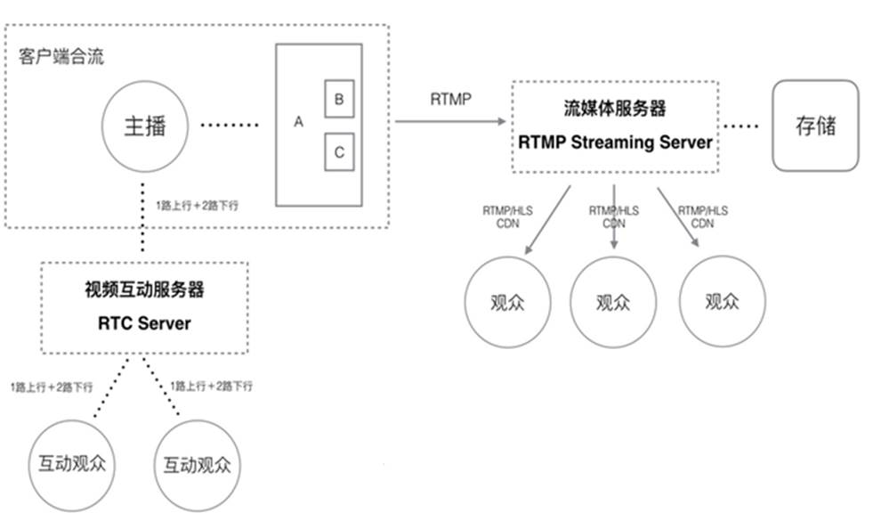
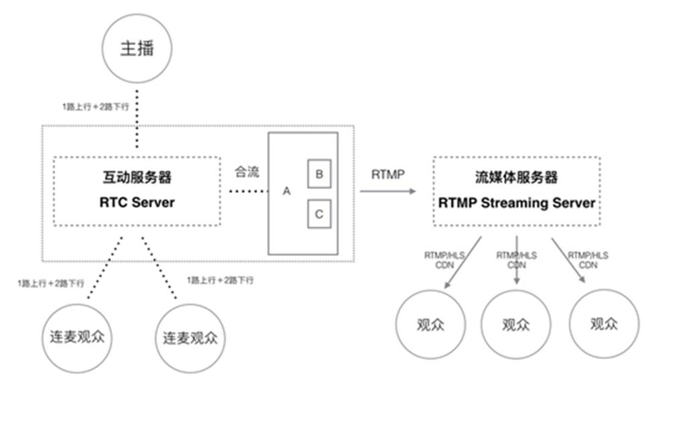
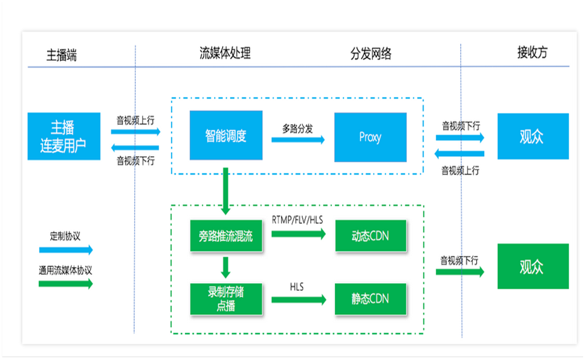
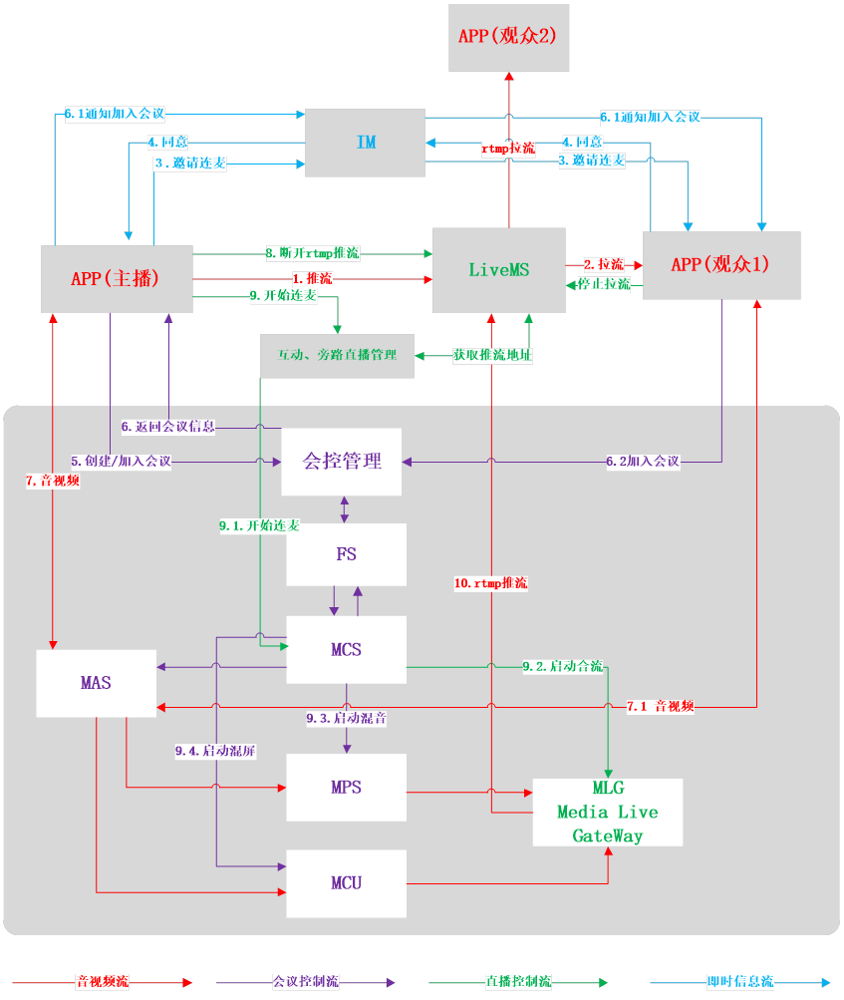
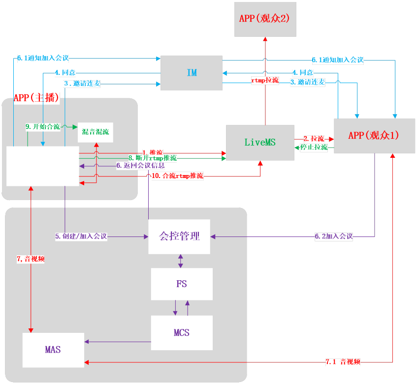

<html>

<head>
<meta http-equiv=Content-Type content="text/html; charset=gb2312">
<meta name=Generator content="Microsoft Word 15 (filtered)">

</head>

<body lang=ZH-CN link=blue vlink=purple style='text-justify-trim:punctuation'>

<b>直播连麦方案设计</b>

目录

<a href="#_Toc495916510">1 简介... 1</a>

<a href="#_Toc495916511">2 连麦互动主要性能指标... 2</a>

<a href="#_Toc495916512">2.1 互动及时性... 2</a>

<a href="#_Toc495916513">2.2 流畅性... 2</a>

<a href="#_Toc495916514">2.3 跨平台互动... 2</a>

<a href="#_Toc495916515">3 常用连麦互动解决方案... 2</a>

<a href="#_Toc495916516">3.1 主播端混流... 2</a>

<a href="#_Toc495916517">3.2 服务器混流... 3</a>

<a href="#_Toc495916518">3.3 方案比较... 4</a>

<a href="#_Toc495916519">3.3.1 主播端混流... 4</a>

<a href="#_Toc495916520">3.3.2 服务器端混流... 5</a>

<a href="#_Toc495916521">4 连麦互动方案设计... 6</a>

<a href="#_Toc495916522">4.1 服务器混流方案设计... 7</a>

<a href="#_Toc495916523">4.1.1&nbsp; 互动直播(连麦) 7</a>

<a href="#_Toc495916524">4.1.2&nbsp; 会议直播(旁路直播) 8</a>

<a href="#_Toc495916525">4.1.3&nbsp; 客户端混流方案设计... 9</a>

&nbsp;

&nbsp;

<h1><a name="_Toc495916510">1 </a>简介</h1>

在一般直播系统，主播与观众交互只能通过文字互动,随着移动直播飞速发展，用户互动体验不断提交，其中连麦互动功能成为直播互动非常重要的功能，成为目前直播系统中标配功能。在传统直播中观众可以与主播发起实时连麦，或者主播与主播之间连麦，增加直播互动性，有更好的的用户体验。

连麦互动的实现可以为更多行业场景带来极大的体验提升。比如在线教育，口语老师的讲课过程中就可以让学生参与阅读发声，学生听到自己的发音同时结合老师及时发音纠正，能够达到很好的教学效果，这对在线教育来说是明显的进步

再比如越来越多的企业需要视频会议，同时也需要将会议信息同步推送到更多员工。过往大型企业的集团会议，总部领导在一个房间里开会，异地分公司的员工也集中在当地的演播厅，以观看视频听报告的形式来参与会议，而用移动手机会议直播，首先可以解决所有人不用集中在固定场所，参会人员之间通过视频连麦形式进行会议讨论，整个过程合成一个画面推送到各个员工手机端。这就是很典型的互动直播企业应用场景，降低开会成本提升开会效率的同时，更容易让一次会议做到很好的上传下达效果。

<h1><a name="_Toc495916511">2 </a>连麦互动主要性能指标</h1>

如何怎么来判断互动直播的成熟度，可以从三个方面来看：

<h2><a name="_Toc495916512"><strong>2.1 </strong></a><strong>互动及时性</strong></h2>

互动及时也就是连麦的观众和主播之间需要高实时，这是正常视频通话的前提。假设及时性不好，很容易看到主播说话10秒之后，连麦的观众才收到回应，这一画面感受会非常不好。

<h2><a name="_Toc495916513"><strong>2.2 </strong></a><strong>流畅性</strong></h2>

当连麦主播产生及时互动内容后，需要立刻以直播的形式传递给更多的观众，这时直播内容的流畅度、清晰度都会直接影响观众的视听体验。

<h2><a name="_Toc495916514"><strong>2.3 </strong></a><strong>跨平台互动</strong></h2>

当互动直播成为直播的常用形态，不论是观众还是主播在PC、手机甚至是外设装备之间都可以发起连麦，在更多场景中进行实时互动，所以跨平台的支撑也将是一个挑战

<h1><a name="_Toc495916515">3 </a>常用连麦互动解决方案</h1>

&nbsp; 连麦互动可以说是传统的直播+视频会议，一般有如下常用的解决方案

<h2><a name="_Toc495916516">3.1 </a>主播端混流</h2>

该实现思路要求主播分别把自己的视频数据与连麦粉丝的视频数据合成，然后把合成好的视频流、主播自己的的音频数据、连麦粉丝的音频数据推给CDN网络，并经由CDN分发给所有观众。故主播端手机负担的任务更重，对手机性能和网络性能要求也比普通直播时更高一些。主播与粉丝连麦，主播端混流部分的基本流程如下图所示：

&nbsp;&nbsp;&nbsp;&nbsp;&nbsp;&nbsp;&nbsp; 

<h2><a name="_Toc495916517">3.2 </a>服务器混流</h2>

所有步骤和在推流端混流几乎一样，只不过工作环境不一样。所有的步骤都是服务端额外增加的工作量。服务端混流的工作内容和推流端混流不一样的地方在于：推流端解码是不管混流还是不混流都要做的事情，而服务端解码却是因为要混流才额外做的工作。混流是一个比较烧资源的事情，服务端是一个资源比较丰富的地方。

&nbsp;

&nbsp;

<h2><a name="_Toc495916518">3.3 </a>方案比较</h2>

<h3><a name="_Toc495916519">3.3.1 </a>主播端混流</h3>

<h4><strong>优点</strong></h4>

<b>1) </b><b>成本点</b>

整体来说，推流端混流是一个低成本的方案。它在两个方面降低成本：计算资源和网络带宽。本质上，在推流端混流就是服务端把混流的成本转嫁给推流端。服务端的计算资源和网络带宽都相对比较昂贵，而推流端的计算资源和网络带宽都是沉着成本。如果在推流端做混流，就降低了服务端的成本，充分利用了推流端能共享的资源

<b>2)&nbsp;
</b><b>服务端压力小</b>

在服务端混流是相对来说是集中的模式，这样会增加服务端的压力。在推流端混流是完全分布式的模式，这样可以降低服务端的压力。

<b>3)&nbsp;
</b><b>本地输出混流后的数据</b>

在推流端混流以后将会输出混流后的音视频流，这样方便本地进行录制，或者直接把音视频流推到CDN网络进行分发。

<h4><strong>缺点</strong></h4>

<b>1)
&nbsp;</b><b>增加额外延迟</b>

首先，在推流端进行混流会增加额外的延迟，主要是因为要等待所有其它推流端的音视频流到达，才能开始混流。从图二我们可以看到，在服务端混流，只要所有主播的音视频流到达服务端，就可以开始混流；在推流端混流，要在前者的基础上，其它所有推流端的音视频流再被拉流到推流端，才能开始混流。这是额外的时间开销。其次，推流端混流完毕以后推流到CDN网络的延迟也相对较大，因为推流端的硬件配置和上行带宽质量都无法和服务端相比。最后，考虑到推流端种种不稳定的情况，额外的延迟只会增多而不会减少。

<b>2)
&nbsp;</b><b>手机硬件配置瓶颈</b>

在推流端进行混流要求比较好的手机硬件配置。一般来说，目前主流的四核手机能满足连麦互动直播的要求。然而，如果算上混流的工作量，手机的硬件配置将会成为瓶颈。比如说，如果安卓手机采用软编，并且需要混的音视频流的数目比较多的话，手机会因为计算量较大而发热，很可能会导致摄像头（离CPU比较近）采集视频的时候出现丢帧的现象。

<b>3)&nbsp;
</b><b>上行网络带宽瓶颈</b>

在推流端进行混流要求比较好的上行网络带宽。如果下行网络带宽是100M bps，那么上行网络带宽相对应一般是1M bps，好一点的会到4M bps。一般情况下，音视频流平均的码率是800k bps。推流端将会推两路流：原始的音视频流和混流后的音视频流，因此总共推流的码率大概是1.6M bps。再考虑到网络带宽在上网人数较多的时间段会打折扣，和网络不稳定等情况，推流端的上行网络带宽往往是不能够满足推流端混流的要求的。

<b>4)&nbsp;
</b><b>推流端环境不可控</b>

综合上面第二和第三点，推流端的环境是不可控的。直播业务平台或者直播云服务平台都没办法管控推流端的硬件配置，使用习惯，网络信号和网络带宽等因素。因此，在推流端做混流的效果也是不可控的。

<b>5)&nbsp;
</b><b>难以扩展</b>

在音视频云服务方案设计阶段，方案一般是易于扩展的。随着直播业务平台的发展，对推流端的计算能力和网络带宽都将会有升级的要求。然而，推流端的环境是不可控的，而且也是难以扩展的。相对而言，在服务端做推流，如果要增加服务端的CPU或者增加网络带宽，都是在音视频云服务平台掌控范围以内的事情。

<b>&nbsp;</b>

<h3><a name="_Toc495916520">3.3.2 </a>服务器端混流</h3>

<h4><strong>优点</strong></h4>

<b>1)
</b><b>低延迟</b>

在服务端混流，天然地具有低延迟的特点。在服务端混流只需要等待所有其它主播的音视频流到达服务端就可以开始混流；在这个基础上，在推流端混流还要从服务端再拉流到推流端，要等待所有其它主播的音视频流被拉下来后才可以开始混流。在服务端混流的系统设计天然地比在推流端混流减少了这一段的网络传输的时间。另外，服务端的计算能力和网络带宽都是要比推流端高几个量级的，混流的过程和推流到CDN网络所耗费的时间，在服务端都会比推流端要来得少。综合起来，服务端混流可以获得比推流端混流低的延迟。

<b>2)
&nbsp;</b><b>计算资源充足</b>

服务端的计算资源相对充足，而且可以进行扩展和调度，不会成为瓶颈。

<b>3)
&nbsp;</b><b>网络带宽资源充足</b>

服务端的网络带宽相对充足，而且可以进行扩展和调度，不会成为瓶颈。

<b>&nbsp;4)&nbsp;
</b><b>可控可扩展</b>

其实这是服务端最大的优势。在服务端有着云服务平台充沛的资源，可以进行弹性的调整和扩展，有着专业团队专业的服务和强力的支持。这是云服务平台的优势；这是集团军作战的方式；这是靠组织打硬仗的理念。说得通俗一点，一般情况下，1个核可以支持5路流，8个核就可以支持40路流，随着流不断增加，可以不断增加CPU，无感知地增强计算能力。换成终端手机的话，是没办法增加CPU的，要么换手机，要么只能等着烧糊。

<h4><strong>缺点</strong></h4>

<b>1)&nbsp;
</b><b>成本高</b>

在服务端混流，会让服务端承担了额外的计算成本和网络带宽成本，从而推高运营成本。

<b>2)&nbsp;
</b><b>压力大</b>

在服务端混流，也叫作集中式混流。音视频流的带宽压力，以及转码和混流的计算压力都会汇集到服务端，天然地增加服务端的压力。这个情况也对服务端的架构设计提出挑战，要求服务端能够有扩展性，能够通过分布式和集群的方式来应对压力。

&nbsp;

<h1><a name="_Toc495916521">4 </a>连麦互动方案设计</h1>

针对目前我们的直播系统，实时音视频系统架构，以及以上介绍常用的互动直播解决方案，设计几种连麦方案。

<h2><a name="_Toc495916522">4.1 </a>服务器混流方案设计</h2>

<h3><a name="_Toc495916523">4.1.1&nbsp; </a>互动直播(连麦)</h3>

流程描述

1.&nbsp;&nbsp;&nbsp;&nbsp;&nbsp;&nbsp;
首先主播通过传统直播推流到直播系统中

2.&nbsp;&nbsp;&nbsp;&nbsp;&nbsp;&nbsp;
观众选择该主播，观看直播

3.&nbsp;&nbsp;&nbsp;&nbsp;&nbsp;&nbsp;
主播在直播房间中，邀请观众互动，或观众申请与主播互动

4.&nbsp;&nbsp;&nbsp;&nbsp;&nbsp;&nbsp;
主播通过IM发送连麦邀请后，观众收到邀请，同意加入连麦

5.&nbsp;&nbsp;&nbsp;&nbsp;&nbsp;&nbsp;
主播收到观众同意加入连麦后，开始向会控管理创建会议，同时加班会议

6.&nbsp;&nbsp;&nbsp;&nbsp;&nbsp;&nbsp;
会议系统返回与会相关信息，包抱会议号，MAS接入参数等，同时将会议号通过IM通知连麦观众。观众收会议号，向会控管理加班该会议,会控管理向观从返回与会相关信息

7.&nbsp;&nbsp;&nbsp;&nbsp;&nbsp;&nbsp;
主播通过MAS接入信息，向会议发送本地音视频信息，同时接收连麦观众音视频信息

连麦观众通过MAS，向会方发送本地音视频信息，同时接收主播音视频信息

8.&nbsp;&nbsp;&nbsp;&nbsp;&nbsp;&nbsp;
主播断开之前rtmp推流，停止当前rtmp流

9.&nbsp;&nbsp;&nbsp;&nbsp;&nbsp;&nbsp;
同时主播向连麦管理发送连麦通知，连麦管理发收到通知后，根据当前频道后，从直播系统获取rtmp地址，该地址是混流后推流地址。同时将会议号，推流地址等参数，通知mcs开始混流，
mcs分别向mps,mcuc通知开始混音，混屏，同时通知mlg将将会议混音，混屏的流转封装成rtmp流，推流到直播系统。

10.&nbsp;&nbsp; 其他观众选择该主播频道，从直播系统拉流观看，主播与连麦观混音混屏的音视频流。

<h3><a name="_Toc495916524">4.1.2&nbsp; </a>会议直播(旁路直播)</h3>

流程描述：

1.&nbsp;&nbsp;&nbsp;&nbsp;&nbsp;&nbsp;
首先是根据会议流程，将两人或多人加入会议，进行会议交流

2.&nbsp;&nbsp;&nbsp;&nbsp;&nbsp;&nbsp;
其他观众不需要参与会议，只需观看会议内容。

3.&nbsp;&nbsp;&nbsp;&nbsp;&nbsp;&nbsp;
直播系统通过会控管理获取会议列表，生成会议与直播频道映射关系

4.&nbsp;&nbsp;&nbsp;&nbsp;&nbsp;&nbsp;
观众选择一个会议，观看这个会议内容

5.&nbsp;&nbsp;&nbsp;&nbsp;&nbsp;&nbsp;
直播系统收到观看请求，首先检查该会议是否正在直播系统，如是正在直播，返回直播内容，否则直播系统发送请求观看会议到旁路直播管理，旁路直播通知mcs，mcs通知mps,mcu混音混屏，通知mlg将会议推送到直播系统

&nbsp;&nbsp;&nbsp;&nbsp;&nbsp;&nbsp;&nbsp;&nbsp;&nbsp;&nbsp;&nbsp;&nbsp;&nbsp;&nbsp;&nbsp;&nbsp;&nbsp;&nbsp;&nbsp;&nbsp;&nbsp;&nbsp;&nbsp;&nbsp;&nbsp;&nbsp;&nbsp;&nbsp;&nbsp;&nbsp;&nbsp;&nbsp;&nbsp;&nbsp;&nbsp;&nbsp;&nbsp;&nbsp;&nbsp;&nbsp;&nbsp;&nbsp;&nbsp;&nbsp;&nbsp;&nbsp;&nbsp;&nbsp;&nbsp;&nbsp;&nbsp;&nbsp;&nbsp;&nbsp;&nbsp;&nbsp;&nbsp;&nbsp;&nbsp;&nbsp;&nbsp;&nbsp;&nbsp;&nbsp;&nbsp;&nbsp;&nbsp;&nbsp;&nbsp;&nbsp;&nbsp;&nbsp;&nbsp;&nbsp;&nbsp;&nbsp;&nbsp;&nbsp;&nbsp;&nbsp;&nbsp;&nbsp;&nbsp;&nbsp;&nbsp;&nbsp;&nbsp;&nbsp;&nbsp;&nbsp;&nbsp;&nbsp;&nbsp;&nbsp;&nbsp;&nbsp;&nbsp;&nbsp;&nbsp;&nbsp;&nbsp;&nbsp;&nbsp;&nbsp;&nbsp;&nbsp;&nbsp;&nbsp;&nbsp;&nbsp;&nbsp;&nbsp;&nbsp;&nbsp;&nbsp;&nbsp;&nbsp;&nbsp;&nbsp;&nbsp;&nbsp;&nbsp;&nbsp;&nbsp;&nbsp;&nbsp;&nbsp;&nbsp;&nbsp;&nbsp;&nbsp;&nbsp;&nbsp;&nbsp;&nbsp;&nbsp;&nbsp;&nbsp;&nbsp; 

<h3><a name="_Toc495916525">4.1.3 &nbsp;</a>客户端混流方案设计</h3>

流程描述

1.&nbsp;&nbsp;&nbsp;&nbsp;&nbsp;&nbsp;
首先主播通过传统直播推流到直播系统中

2.&nbsp;&nbsp;&nbsp;&nbsp;&nbsp;&nbsp;
观众选择该主播，观看直播

3.&nbsp;&nbsp;&nbsp;&nbsp;&nbsp;&nbsp;
主播在直播房间中，邀请观众互动，或观众申请与主播互动

4.&nbsp;&nbsp;&nbsp;&nbsp;&nbsp;&nbsp;
主播通过IM发送连麦邀请后，观众收到邀请，同意加入连麦

5.&nbsp;&nbsp;&nbsp;&nbsp;&nbsp;&nbsp;
主播收到观众同意加入连麦后，开始向会控管理创建会议，同时加班会议

6.&nbsp;&nbsp;&nbsp;&nbsp;&nbsp;&nbsp;
会议系统返回与会相关信息，包抱会议号，MAS接入参数等，同时将会议号通过IM通知连麦观众。观众收会议号，向会控管理加班该会议,会控管理向观从返回与会相关信息

7.&nbsp;&nbsp;&nbsp;&nbsp;&nbsp;&nbsp;
主播通过MAS接入信息，向会议发送本地音视频信息，同时接收连麦观众音视频信息

连麦观众通过MAS，向会方发送本地音视频信息，同时接收主播音视频信息

8.&nbsp;&nbsp;&nbsp;&nbsp;&nbsp;&nbsp;
主播断开之前rtmp推流，停止当前rtmp流，将主播与观众音视频合流后，使用rtmp流推送到直播系统

9.&nbsp;&nbsp;&nbsp;&nbsp;&nbsp;&nbsp;
其他观众选择该主播频道，从直播系统拉流观看，主播与连麦观混音混屏的音视频流。

&nbsp;

</body>

</html>
