<html>

<head>
<meta http-equiv=Content-Type content="text/html; charset=gb2312">
<meta name=Generator content="Microsoft Word 15 (filtered)">

</head>

<body lang=ZH-CN link="#0563C1" vlink="#954F72" style='text-justify-trim:punctuation'>

<h1><a name="_Toc37241465">SIP客户端接入会议方案</a></h1>

目录

<a href="#_Toc37241465">SIP客户端接入会议方案... 1</a>

<a href="#_Toc37241466">需求... 1</a>

<a href="#_Toc37241467">应用场景... 1</a>

<a href="#_Toc37241468">客户端接入场景... 1</a>

<a href="#_Toc37241469">需混屏场景... 1</a>

<a href="#_Toc37241470">系统设计... 1</a>

<a href="#_Toc37241471">系统架构... 1</a>

<a href="#_Toc37241472">SIP单流架构... 1</a>

<a href="#_Toc37241473">SIP双流架构... 1</a>

<a href="#_Toc37241474">客户端视频流交互... 1</a>

<a href="#_Toc37241475">一个SIP客户端(单流)与会议客户端... 1</a>

<a href="#_Toc37241476">一个SIP客户端(单流)与会议客户端(共享屏幕) 1</a>

<a href="#_Toc37241477">一个SIP客户端(双流)与会议客户端... 1</a>

<a href="#_Toc37241478">一个SIP客户端(双流)与会议客户端(共享屏幕) 1</a>

<a href="#_Toc37241479">两个SIP客户端... 1</a>

<a href="#_Toc37241480">两个SIP客户端(共享屏幕) 1</a>

<a href="#_Toc37241481">两个SIP客户端与一个会议客户端... 1</a>

<a href="#_Toc37241482">两个SIP客户端与一个会议客户端(共享屏幕) 1</a>

<a href="#_Toc37241483">两个SIP客户端(共享屏幕)与一个会议客户端... 1</a>

<a href="#_Toc37241484">客户端音视交互... 1</a>

<a href="#_Toc37241485">sip客户端与会议系统信令与媒体交互... 1</a>

<a href="#_Toc37241486">sip客户端与会议系统信令与媒体交互(混屏) 1</a>

<a href="#_Toc37241487">测试用例... 1</a>

&nbsp;

<b>&nbsp;</b>

<b>&nbsp;</b>

<b>&nbsp;</b>

<b>&nbsp;</b>

<b>&nbsp;</b>

<h1><a name="_Toc37241466">需求</a></h1>

&nbsp;&nbsp;&nbsp;会议系统需要接入第三方客户端，目前市场上的第三方客户端一般都支持sip，如果需要兼容第三方客户端，需要在会议系统上支持sip接入。第三方sip客户端一般有两种类型，视频单流与双流两种。

&nbsp;&nbsp;
开会时有可能有多个人加入会议，而对针三方sip客户端的媒体通道是有限，不可能将其他人每人独身创建一个通道来显示，所以sip客户端显示其他会议成员时，只能将其他人合并一路流，返回给sip客户端显示。如果支持双流，将会议共享视频返回sip sub通道。

否则同时将会议共享视频与成员视频混成一路，返回给sip main通道。

<h1><a name="_Toc37241467">应用场景</a></h1>

<h2><a name="_Toc37241468">客户端接入场景</a></h2>

&nbsp;&nbsp; 针对一个会议系统，不同客户端同时加入会议时，有不同类型的客户端

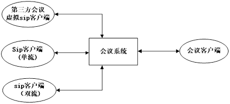

各个客户端在不同场合下，一般有这些使用场景

1.&nbsp;
一个sip客户端，一个自研客户端

2.&nbsp;
仅有一个或以上自研客户端

3.&nbsp;
一个sip客户端，多个自研客户端

4.&nbsp;
仅有一个或以上sip客户端

5.&nbsp;
多个sip客户端，一个自研客户端

6.&nbsp;
多个sip客户端，多个自研客户端

如果就两个客户端，就是点对点方式，多于两个客户端是会议

sip客户端有单流与双流之分。针对单流，如果只看其中一人视频，直接转发，否则需要混屏成一路再转发。 针对双流，如果只看其中一人视频，同时看共享屏幕，直接转发，否则混屏成一

&nbsp;

<h2><a name="_Toc37241469">需混屏场景</a></h2>

<table class=MsoNormalTable border=0 cellspacing=0 cellpadding=0 width=548
 style='width:411.1pt;border-collapse:collapse'>
 <tr style='height:14.25pt'>
  <td width=95 nowrap valign=top style='width:71.0pt;background:#D9D9D9;
  padding:0cm 5.4pt 0cm 5.4pt;height:14.25pt'>
  
<b>三方客户端</b>

  </td>
  <td width=74 nowrap colspan=2 valign=top style='width:55.45pt;background:
  #D9D9D9;padding:0cm 5.4pt 0cm 5.4pt;height:14.25pt'>
  
<b>共享视频</b>

  </td>
  <td width=76 nowrap valign=top style='width:2.0cm;background:#D9D9D9;
  padding:0cm 5.4pt 0cm 5.4pt;height:14.25pt'>
  
<b>点对点</b>

  </td>
  <td width=304 nowrap valign=top style='width:227.95pt;background:#D9D9D9;
  padding:0cm 5.4pt 0cm 5.4pt;height:14.25pt'>
  
<b>会议</b>

  </td>
 </tr>
 <tr style='height:14.25pt'>
  <td width=95 nowrap valign=bottom style='width:71.0pt;padding:0cm 5.4pt 0cm 5.4pt;
  height:14.25pt'>
  
单流

  </td>
  <td width=68 nowrap valign=bottom style='width:51.0pt;padding:0cm 5.4pt 0cm 5.4pt;
  height:14.25pt'>
  
无

  </td>
  <td width=82 nowrap colspan=2 valign=bottom style='width:61.15pt;padding:
  0cm 5.4pt 0cm 5.4pt;height:14.25pt'>
  
不混屏

  </td>
  <td width=304 nowrap valign=bottom style='width:227.95pt;padding:0cm 5.4pt 0cm 5.4pt;
  height:14.25pt'>
  
混屏所有

  </td>
 </tr>
 <tr style='height:14.25pt'>
  <td width=95 nowrap valign=bottom style='width:71.0pt;padding:0cm 5.4pt 0cm 5.4pt;
  height:14.25pt'>
  
单流

  </td>
  <td width=68 nowrap valign=bottom style='width:51.0pt;padding:0cm 5.4pt 0cm 5.4pt;
  height:14.25pt'>
  
有

  </td>
  <td width=82 nowrap colspan=2 valign=bottom style='width:61.15pt;padding:
  0cm 5.4pt 0cm 5.4pt;height:14.25pt'>
  
混屏

  </td>
  <td width=304 nowrap valign=bottom style='width:227.95pt;padding:0cm 5.4pt 0cm 5.4pt;
  height:14.25pt'>
  
首先混屏成员，后共享混屏

  </td>
 </tr>
 <tr style='height:14.25pt'>
  <td width=95 nowrap valign=bottom style='width:71.0pt;padding:0cm 5.4pt 0cm 5.4pt;
  height:14.25pt'>
  
双流

  </td>
  <td width=68 nowrap valign=bottom style='width:51.0pt;padding:0cm 5.4pt 0cm 5.4pt;
  height:14.25pt'>
  
无

  </td>
  <td width=82 nowrap colspan=2 valign=bottom style='width:61.15pt;padding:
  0cm 5.4pt 0cm 5.4pt;height:14.25pt'>
  
不混屏

  </td>
  <td width=304 nowrap valign=bottom style='width:227.95pt;padding:0cm 5.4pt 0cm 5.4pt;
  height:14.25pt'>
  
混屏所有

  </td>
 </tr>
 <tr style='height:14.25pt'>
  <td width=95 nowrap valign=bottom style='width:71.0pt;padding:0cm 5.4pt 0cm 5.4pt;
  height:14.25pt'>
  
双流

  </td>
  <td width=68 nowrap valign=bottom style='width:51.0pt;padding:0cm 5.4pt 0cm 5.4pt;
  height:14.25pt'>
  
有

  </td>
  <td width=82 nowrap colspan=2 valign=bottom style='width:61.15pt;padding:
  0cm 5.4pt 0cm 5.4pt;height:14.25pt'>
  
不混屏

  </td>
  <td width=304 nowrap valign=bottom style='width:227.95pt;padding:0cm 5.4pt 0cm 5.4pt;
  height:14.25pt'>
  
混屏成员，共享不混屏

  </td>
 </tr>
 <tr height=0>
  <td width=95 style='border:none'></td>
  <td width=68 style='border:none'></td>
  <td width=6 style='border:none'></td>
  <td width=76 style='border:none'></td>
  <td width=304 style='border:none'></td>
 </tr>
</table>

&nbsp;

<h1><a name="_Toc37241470">系统设计</a></h1>

<h2><a name="_Toc37241471">系统架构</a></h2>

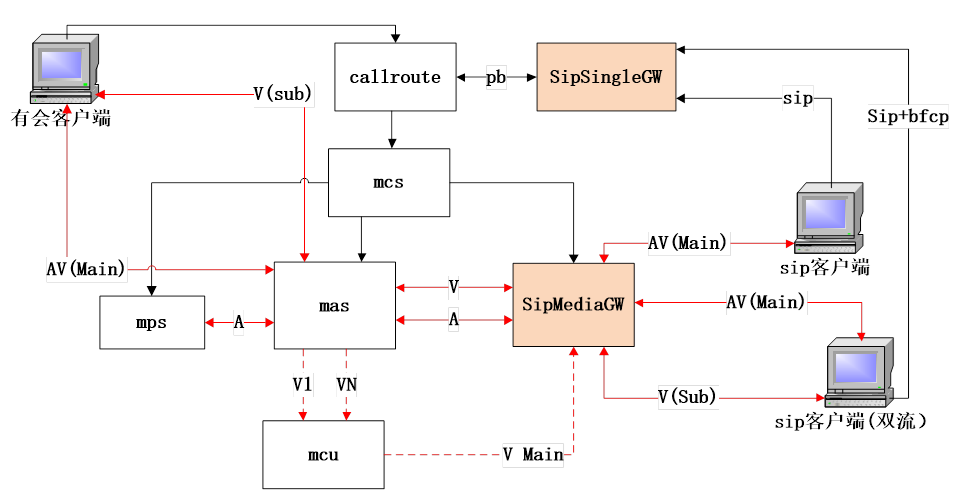

sipsingGW是sip客户端的信令网关，实现了sip协议栈，同时将sip信令转封后生成自有协议与会议callroute交互

SipMediaGW是sip客户端媒体网关，完成sip客户端与会议mas媒体的中转

&nbsp;

1.&nbsp;
sip客户端与sip信令网关连接， 信令网关将客户端信令，封装后转发给callroute

2.&nbsp;
callroute将信息能通知mcs, mcs将sip客户端加入会议，同时通知mas与sip媒体网关创建媒体通道，同时获取相关信息，返回给callroute, callroute同时返回sip信令网

再返回给sip客户端

3.&nbsp;
sip客户端收到媒体通道相关信息之后，将本地媒体，发送给sip媒体网关，同时媒体网关将转发到mas,&nbsp; sip从媒体网关转发过来的其他成员媒体

4.&nbsp;
sip客户端接收其他成员视频时，mas将媒体转发到sip媒体网关，媒体网关再转发到sip客户端

<h2><a name="_Toc37241472">SIP单流架构</a></h2>

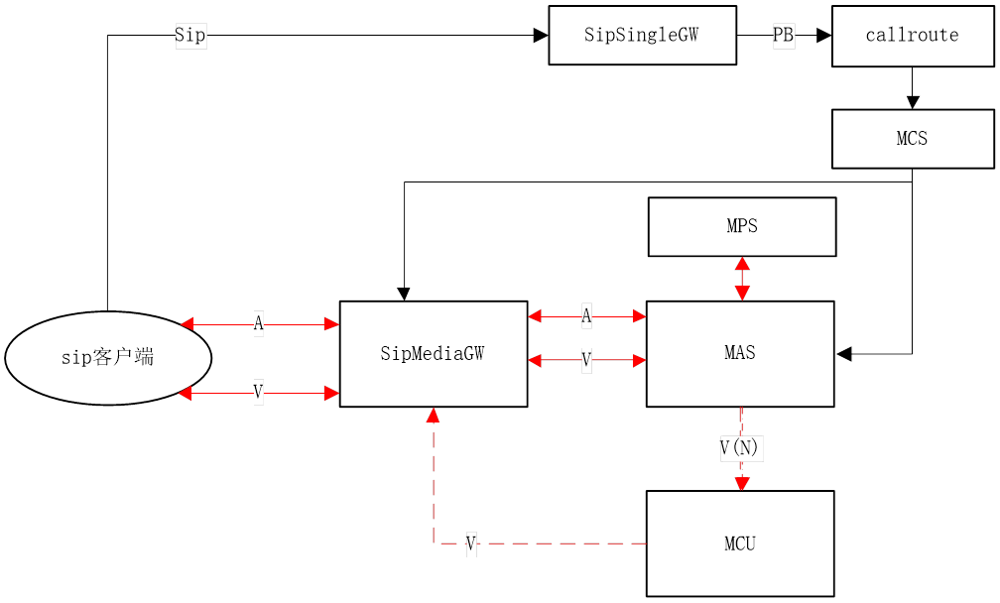

1.&nbsp;
sip客户端加入会议，将媒体发送给sip网关，

2.&nbsp;
如果接收其他人视频时，加入会议时，mcs会检查，如果对方是一个人，通知mas将对方媒体转发给sip媒体网关，

3.&nbsp;
如果对方是多个人，或需要共享视频，先停止mas的成员视频，将多人成员视频与共享视频转发给mcu, mcu混屏之后，再转发给媒体网关

<h2><a name="_Toc37241473">SIP双流架构</a></h2>

 

&nbsp;

1.&nbsp;
sip客户端加入会议，将媒体发送给sip网关，

2.&nbsp;
如果接收其他人视频时，加入会议时，mcs会检查，如果对方是一个人，通知mas将对方媒体转发给sip媒体网关，如果是多个，需要已停止mas到媒休网关的转发，发送到mcu, mcu将多人混屏，再转发给sip媒体网关

3.&nbsp;
如果需要共享视频，通知mas将共享视频，转发给sip媒体网关

<h2><a name="_Toc37241474">客户端视频流交互</a></h2>

<h3><a name="_Toc37241475">一个SIP客户端(单流)与会议客户端</a></h3>

<h3><a name="_Toc37241476">一个SIP客户端(单流)与会议客户端(共享屏幕)</a></h3>

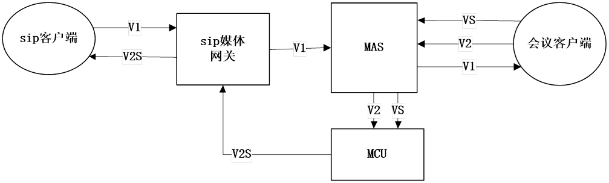

S:代表共享视频，屏幕视频

<h3><a name="_Toc37241477">一个SIP客户端(双流)与会议客户端</a></h3>

<h3><a name="_Toc37241478">一个SIP客户端(双流)与会议客户端(共享屏幕)</a></h3>

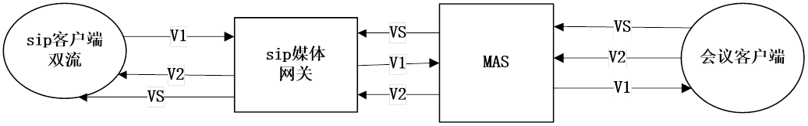

<h3><a name="_Toc37241479">两个SIP客户端</a></h3>

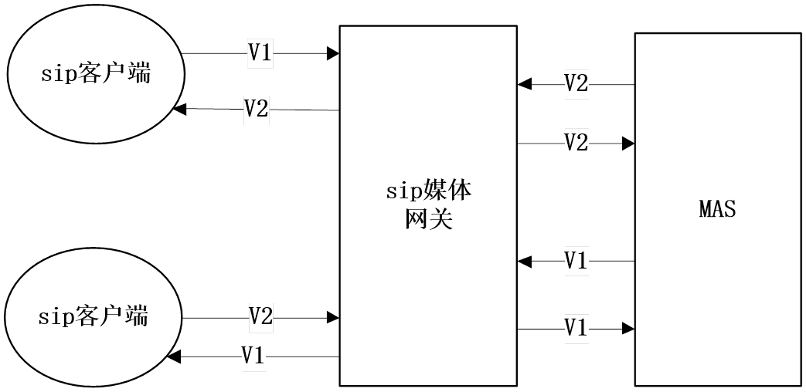

&nbsp;

<h3><a name="_Toc37241480">两个SIP客户端(共享屏幕)</a></h3>

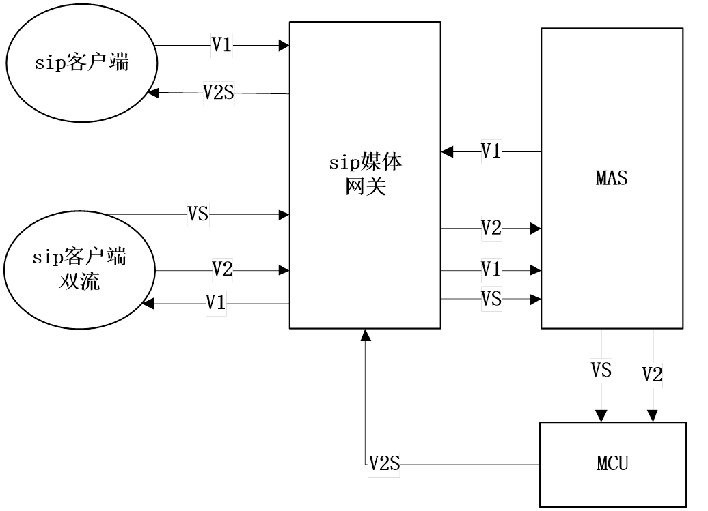

<h3><a name="_Toc37241481">两个SIP客户端与一个会议客户端</a></h3>

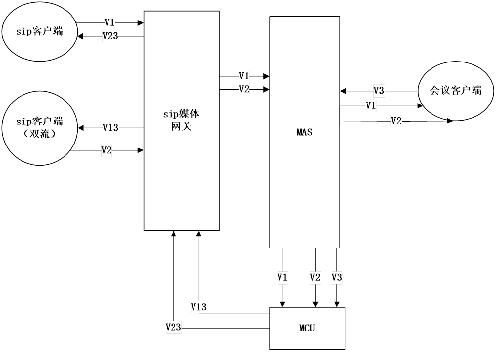

<h3><a name="_Toc37241482">两个SIP客户端与一个会议客户端(共享屏幕)</a></h3>

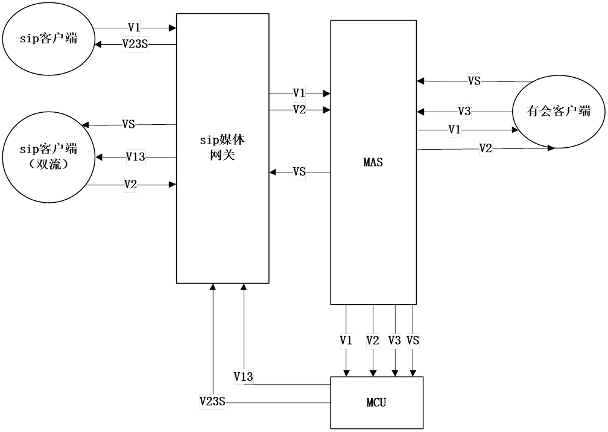

<h3><a name="_Toc37241483">两个SIP客户端(共享屏幕)与一个会议客户端</a></h3>

<h2><a name="_Toc37241484">客户端音视交互</a></h2>

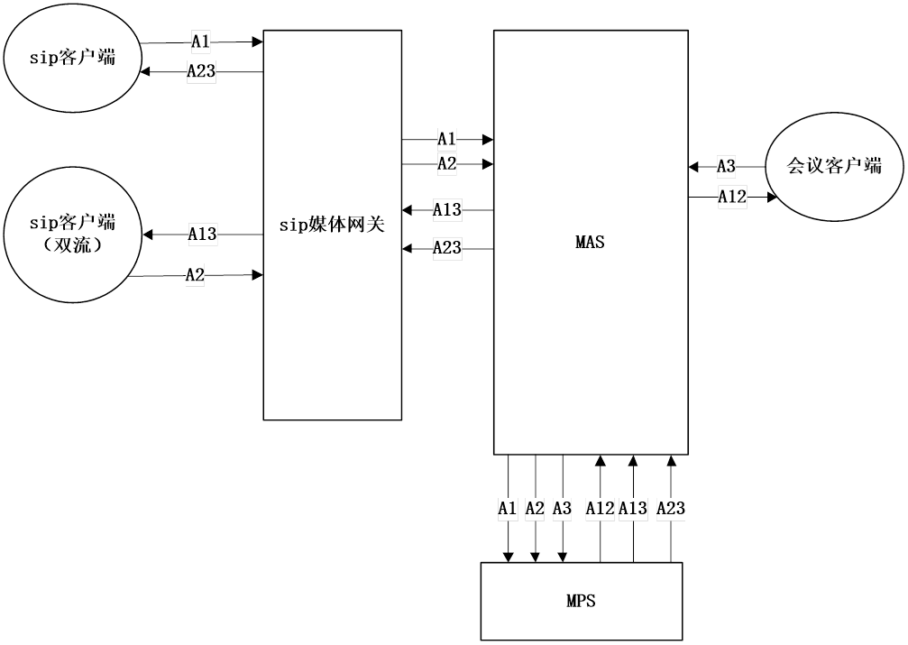

<h2><a name="_Toc37241485">sip客户端与会议系统信令与媒体交互</a></h2>

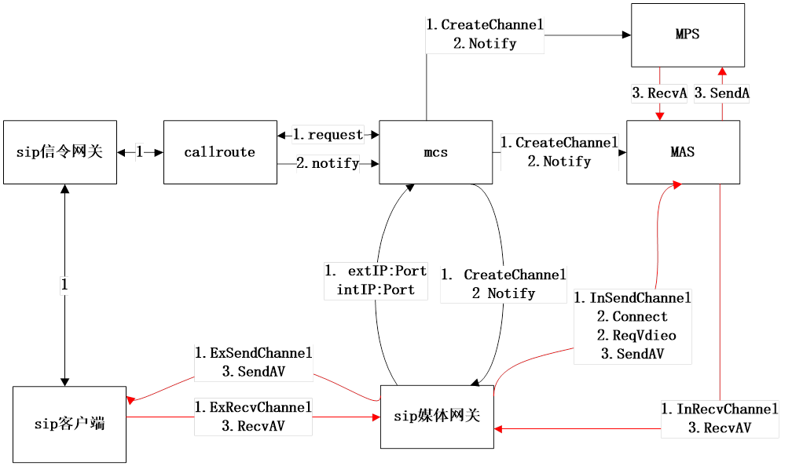

&nbsp;

1.&nbsp;&nbsp;&nbsp;&nbsp;
sip客户端连接到sip信令网关

2.&nbsp;&nbsp;&nbsp;&nbsp;
sip信令网关将sip协议请求转发pb私有协议后，再通知callroute, callroute首先发送request命令，请求mcs创建相关媒体通道

3.&nbsp;&nbsp;&nbsp;&nbsp;
mcs收到request命令，分别给sip媒体网关,mas, mps发送CreateChannel发送创建媒体通道，

4.&nbsp;&nbsp;&nbsp;&nbsp;
sip媒体网关收到CreateChannel后，创建与sip客户端发送与接收媒体的通道（外网），同时创建与mas发送与接收的媒体通道(内网)。sip媒体网关就内外网地址与端口返回mcs, mcs将返回结果原路返回callroute ,
callroute=&gt;sip信令网关 将转换sip协议sdp返回给sip客户端

5.&nbsp;&nbsp;&nbsp;&nbsp;
mas收到CreateChannel创建相应的媒体通道，mps收到CreateChannel创建相应通道

6.&nbsp;&nbsp;&nbsp;&nbsp;
同时callroute发送notify命令给mcs, mcs将其分别发送给sip媒体网关,mas,mps,

sip媒体网关收到notify后，连接到mas,打通媒体通道，同时向mas发送请求对方视频请求。

7.&nbsp;&nbsp;&nbsp;&nbsp;
sip客户端根据返回的信息，创建媒体，向sip媒体网关发送媒体，同时请求对方音视频

&nbsp;

<h2><a name="_Toc37241486">sip客户端与会议系统信令与媒体交互(混屏)</a></h2>

&nbsp;

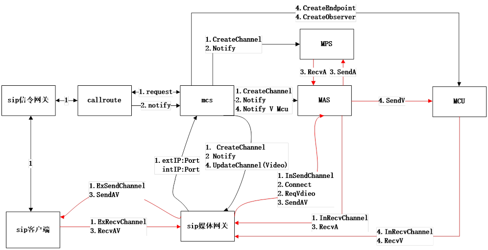

该流程是在sip客户端已加入会议但为混屏情况下进行

1.&nbsp;&nbsp;&nbsp;&nbsp;
mcs给mcu发送CreateEndpoint, mcu返回IP与端口

2.&nbsp;&nbsp;&nbsp;&nbsp;
mcs 发送notify 通知mas把视频发送给MCU

3.&nbsp;&nbsp;&nbsp;&nbsp;
mcs 给 sip媒体网关发送updateChannel 将通道停止从mas拉流，准备从mcu接收视频

4.&nbsp;&nbsp;&nbsp;&nbsp;
mcs 给mcu 发送CreateObserver命令，将混屏输出到sip媒体网关的视频通道

&nbsp;

<h1><a name="_Toc37241487">测试用例</a></h1>

1.&nbsp;&nbsp;&nbsp;&nbsp;
sip客户端加入会议后，会议客户端没有共享屏幕

2.&nbsp;&nbsp;&nbsp;&nbsp;
sip客户端加入会议后，会议客户端已开共享屏幕

3.&nbsp;&nbsp;&nbsp;&nbsp;
sip客户端，会议客户端加入会议后，再开启共享屏幕

4.&nbsp;&nbsp;&nbsp;&nbsp;
sip客户端退出会议

5.&nbsp;&nbsp;&nbsp;&nbsp;
会议客户端退出会议，

6.&nbsp;&nbsp;&nbsp;&nbsp;
sip双流客户端加入会议，同时开启共享

7.&nbsp;&nbsp;&nbsp;&nbsp;
先一sip客户端加入会议， 不段有不同客户端加入会议

8.&nbsp;&nbsp;&nbsp;&nbsp;
一段时间内有不同客户端退出会议，最后只剩一个sip客户端

9.&nbsp;&nbsp;&nbsp;&nbsp;
sip客户端加入，马入退出会议

10.&nbsp; 所有sip客户端退出会议，只剩会议客户端

11.&nbsp; 会议客户端已开共享屏幕，
双流sip客户端再开共享屏幕

12.&nbsp; sip客户端双流加入会议后，会议已开启共享屏幕，再关闭共享屏幕

13.&nbsp; sip客户端单流加入会议后，会议已开启共享屏幕，再关闭共享屏幕

&nbsp;

</body>

</html>
