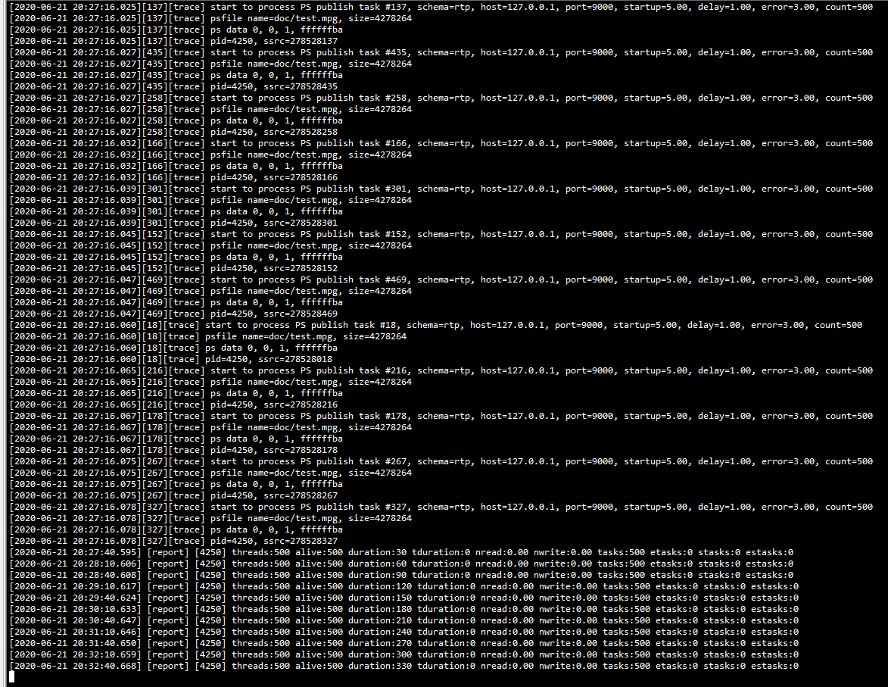
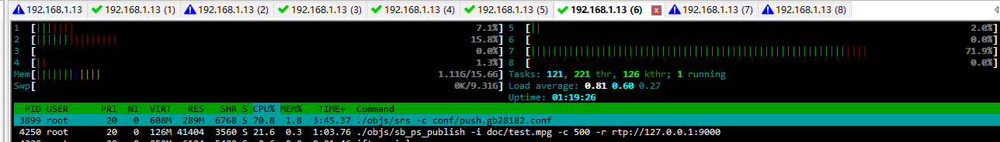
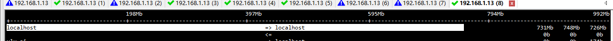
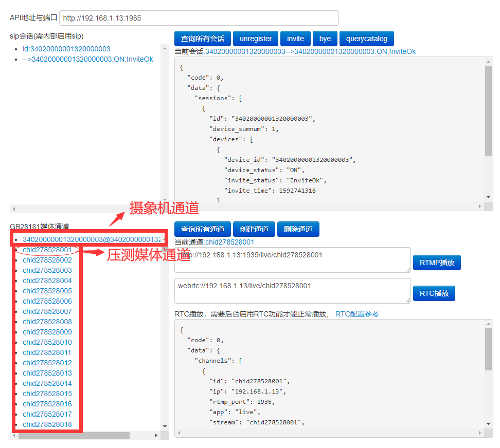
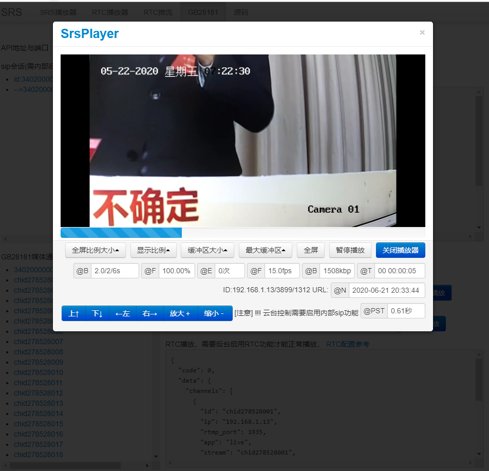

## SRS GB28181 PS流压测工具使用说明
   srs-bench提供系例对srs进行性能压测工具，其中工具包括如下，sb_ps_publish是在之前srs-bench基础针对ps流的压测工具 

     sb_http_load  http flv拉流压测工具
     sb_hls_load  hls拉流压测工具
     sb_rtmp_load  rtmp拉流压测工具
     sb_rtmp_load_fast rtmp拉流压测工具
     sb_rtmp_publish  rtmp推流压测工具
     sb_ps_publish    ps流压测工具
### 获取与编译

    git clone https://github.com/xialixin/srs-bench.git 或 git clone https://gitee.com/kyxlx550/srs-bench.git
    cd srs-bench
    ./confgure
    make
    
	build ok, you can:
     ./objs/sb_http_load
     ./objs/sb_hls_load
     ./objs/sb_rtmp_load
     ./objs/sb_rtmp_load_fast
     ./objs/sb_rtmp_publish
     ./objs/sb_ps_publish
 该分支是在srs官网srs-bench基础开发，添加了sb_ ps_ publish工具，[srs-bench官网地址](https://github.com/ossrs/srs-bench)

如果出现以上结果证明编译成功，接收使用相关命令进行压测，这里只介绍sb_ps_publish压测gb28181 ps流

### 修改linux内核高性能参数
在进行压测之前，如果linux内核高性能一些测试没有需要，需要修改配置，  
首先打开/etc/sysctl.conf  复制如下内容到sysctl.conf 

	net.core.rmem_default = 262144
	net.core.rmem_max = 16777216
	net.core.wmem_default = 262144
	net.core.wmem_max = 16777216
	net.core.somaxconn = 262144
	net.core.netdev_max_backlog = 262144
	net.ipv4.tcp_max_orphans = 262144
	net.ipv4.tcp_max_syn_backlog = 262144
	net.ipv4.tcp_max_tw_buckets = 10000
	net.ipv4.ip_local_port_range = 1024 65500
	net.ipv4.tcp_tw_recycle = 1
	net.ipv4.tcp_tw_reuse = 1
	net.ipv4.tcp_syncookies = 1
	net.ipv4.tcp_synack_retries = 1
	net.ipv4.tcp_syn_retries = 1
	net.ipv4.tcp_fin_timeout = 30
	net.ipv4.tcp_keepalive_time = 600
	net.ipv4.tcp_keepalive_intvl = 30
	net.ipv4.tcp_keepalive_probes = 3
	net.ipv4.tcp_mem = 786432 1048576 1572864
	fs.aio-max-nr = 1048576
	fs.file-max = 6815744
	kernel.sem = 250 32000 100 128
	vm.swappiness = 0 

 保存之后 执行 sysctl -p 命令，使其生效

参数详细说明    

	#接收套接字缓冲区大小的默认值(以字节为单位)。   
	net.core.rmem_default = 262144  
	#接收套接字缓冲区大小的最大值(以字节为单位)。  
	net.core.rmem_max = 16777216  
	#发送套接字缓冲区大小的默认值(以字节为单位)。  
	net.core.wmem_default = 262144  
	#发送套接字缓冲区大小的最大值(以字节为单位)。  
	net.core.wmem_max = 16777216  
	#用来限制监听(LISTEN)队列最大数据包的数量，超过这个数量就会导致链接超时或者触发重传机制。  
	net.core.somaxconn = 262144  
	#当网卡接收数据包的速度大于内核处理的速度时，会有一个队列保存这些数据包。这个参数表示该队列的最大值。  
	net.core.netdev_max_backlog = 262144  
	#表示系统中最多有多少TCP套接字不被关联到任何一个用户文件句柄上。如果超过这里设置的数字，连接就会复位并输出警告信息。这个限制仅仅是为了防止简单的DoS攻击。此值不能太小。  
	net.ipv4.tcp_max_orphans = 262144  
	#表示那些尚未收到客户端确认信息的连接（SYN消息）队列的长度，默认为1024，加大队列长度为262144，可以容纳更多等待连接的网络连接数。  
	net.ipv4.tcp_max_syn_backlog = 262144  
	#表示系统同时保持TIME_WAIT套接字的最大数量。如果超过此数，TIME_WAIT套接字会被立刻清除并且打印警告信息。之所以要设定这个限制，纯粹为了抵御那些简单的DoS攻击，不过，过多的TIME_WAIT套接字也会消耗服务器资源，甚至死机。  
	net.ipv4.tcp_max_tw_buckets = 10000  
	#表示允许系统打开的端口范围。  
	net.ipv4.ip_local_port_range = 1024 65500  
	#以下两参数可解决生产场景中大量连接的服务器中TIME_WAIT过多问题。  
	#表示开启TCP连接中TIME_WAIT套接字的快速回收，默认为0，表示关闭。  
	net.ipv4.tcp_tw_recycle = 1  
	#表示允许重用TIME_WAIT状态的套接字用于新的TCP连接,默认为0，表示关闭。  
	net.ipv4.tcp_tw_reuse = 1
	#当出现SYN等待队列溢出时，启用cookies来处理，可防范少量SYN攻击，默认为0，表示关闭。
	net.ipv4.tcp_syncookies = 1
	#表示系统允许SYN连接的重试次数。为了打开对端的连接，内核需要发送一个SYN并附带一个回应前面一个SYN的ACK包。也就是所谓三次握手中的第二次握手。这个设置决定了内核放弃连接之前发送SYN+ACK包的数量。
	net.ipv4.tcp_synack_retries = 1
	#表示在内核放弃建立连接之前发送SYN包的数量。
	net.ipv4.tcp_syn_retries = 1
	#减少处于FIN-WAIT-2连接状态的时间，使系统可以处理更多的连接。
	net.ipv4.tcp_fin_timeout = 30
	#这个参数表示当keepalive启用时，TCP发送keepalive消息的频度。默认是2小时，若将其设置得小一些，可以更快地清理无效的连接。
	net.ipv4.tcp_keepalive_time = 600
	#探测消息未获得响应时，重发该消息的间隔时间（秒）。系统默认75秒。
	net.ipv4.tcp_keepalive_intvl = 30
	#在认定连接失效之前，发送多少个TCP的keepalive探测包。系统默认值是9。这个值乘以tcp_keepalive_intvl之后决定了，一个连接发送了keepalive探测包之后可以有多少时间没有回应。
	net.ipv4.tcp_keepalive_probes = 3
	#确定TCP栈应该如何反映内存使用，每个值的单位都是内存页（通常是4KB）。第一个值是内存使用的下限；第二个值是内存压力模式开始对缓冲区使用应用压力的上限；第三个值是内存使用的上限。在这个层次上可以将报文丢弃，从而减少对内存的使用。示例中第一个值为786432*4/1024/1024=3G，第二个值为1048576*4/1024/1024=4G，第三个值为1572864*4/1024/1024=6G。
	net.ipv4.tcp_mem = 786432 1048576 1572864
	#此参数限制并发未完成的异步请求数目，应该设置避免I/O子系统故障。
	fs.aio-max-nr = 1048576
	#该参数决定了系统中所允许的文件句柄最大数目，文件句柄设置代表linux系统中可以打开的文件的数量。
	fs.file-max = 6815744
	#第一列，表示每个信号集中的最大信号量数目。
	#第二列，表示系统范围内的最大信号量总数目。
	#第三列，表示每个信号发生时的最大系统操作数目。
	#第四列，表示系统范围内的最大信号集总数目。
	#（第一列）*（第四列）=（第二列）
	kernel.sem = 250 32000 100 128
	#表示尽量使用内存，减少使用磁盘swap交换分区，内存速度明显高于磁盘一个数量级。
	vm.swappiness = 0

### PS流压测  

	cd srs-bench
	./objs/sb_ps_publish
    执行上面命令，会打印该命令的使用方法，
	Examples:
	1. start a client
	   ./objs/sb_ps_publish -i doc/test.mpg -c 1 -r rtp://127.0.0.1:9000
	2. start 1000 clients
	   ./objs/sb_ps_publish -i doc/test.mpg -c 1000 -r rtp://127.0.0.1:9000
	3. start 10000 clients
	   ./objs/sb_ps_publish -i doc/test.mpg -c 10000 -r rtp://127.0.0.1:9000
	4. start 100000 clients
	   ./objs/sb_ps_publish -i doc/test.mpg -c 100000 -r rtp://127.0.0.1:9000
	
    -i ps流文件，如果需要自己生成，你需要修改srs gb28181代码，启用#define W_PS_FILE 会生成相应ps流文件
    -c 压测的线程数， 一般一个进程不要超过500
    -r srs监听ps流的IP与端口
    -p 客户端绑定的开始端口 如-p 3000  -c 5   则客户端的端品3000-3004， 如果不指定客户端端口随机分配

#### 压测500路
     ./objs/sb_ps_publish -i doc/test.mpg -c 500 -r rtp://127.0.0.1:9000
  命令显示结果
    
  
  
  CPU使用情况，可使用htop 显示结果

  
  
  500路流量，可使使用iftop -i lo 显示结果   
  流量限制与网卡容量有关，测试环境的网卡是1G

  
  
  Gb28181压测的媒体列表
  压测工具的中媒体ssrc是pid+index组成, uint32_t ssrc = pid << 16 | GetId();  

    
  