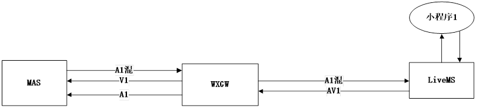
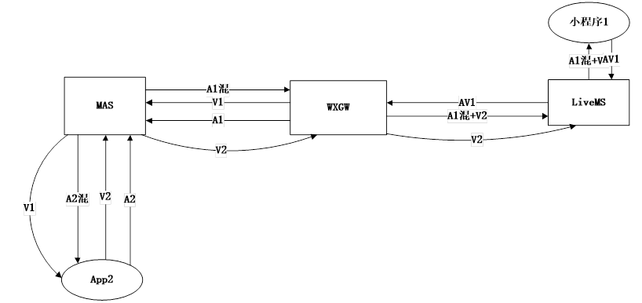
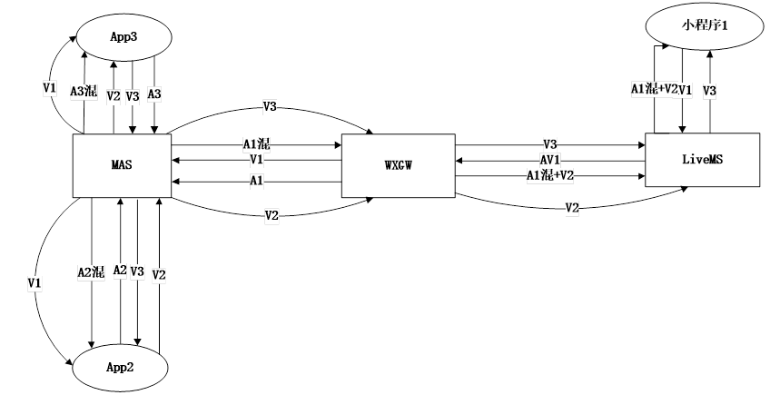
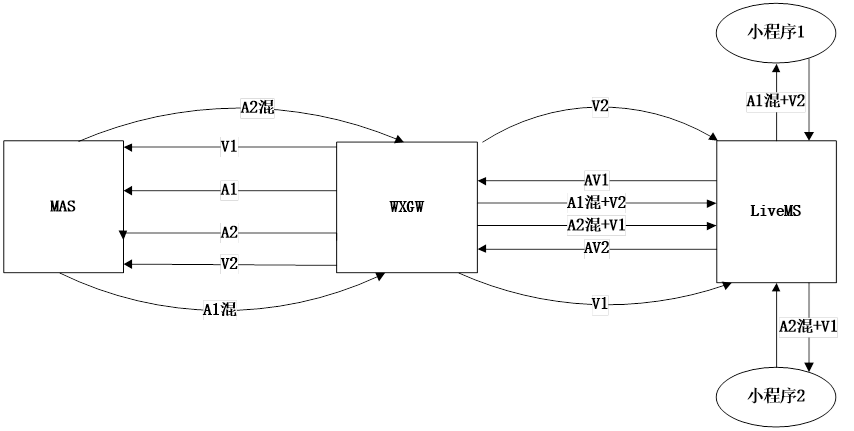
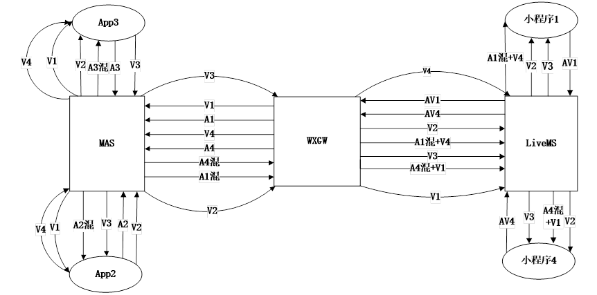
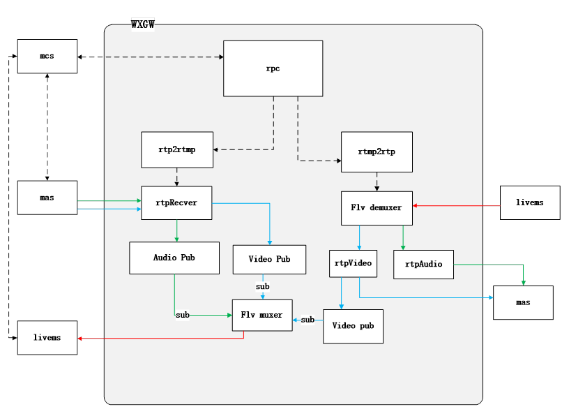
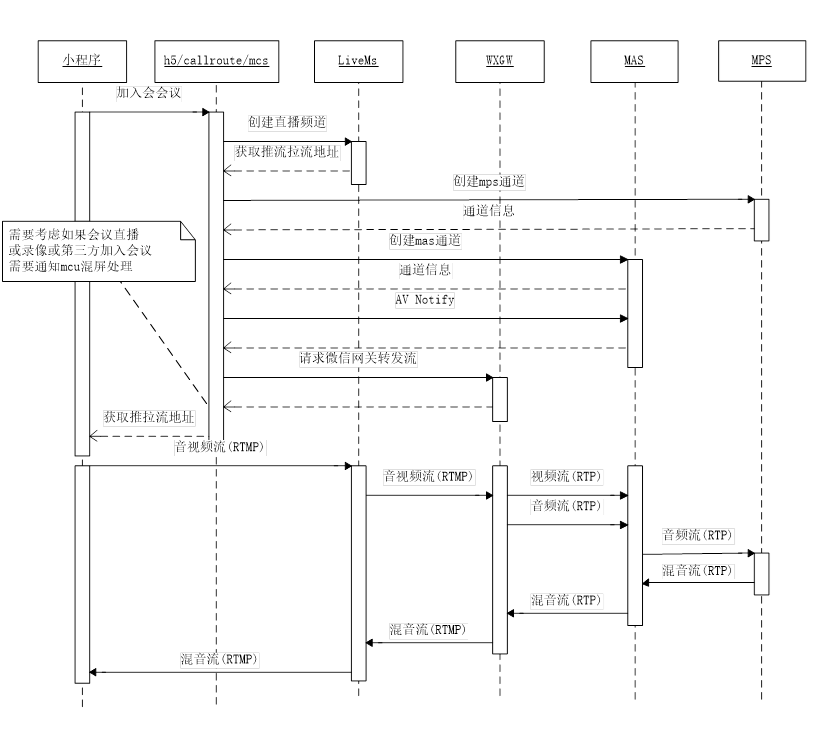
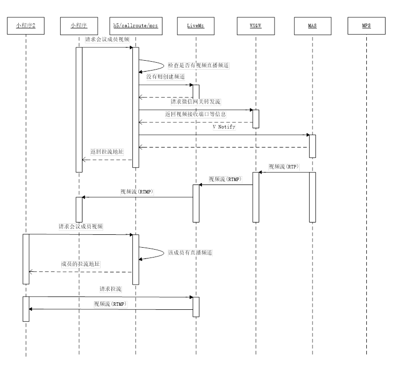
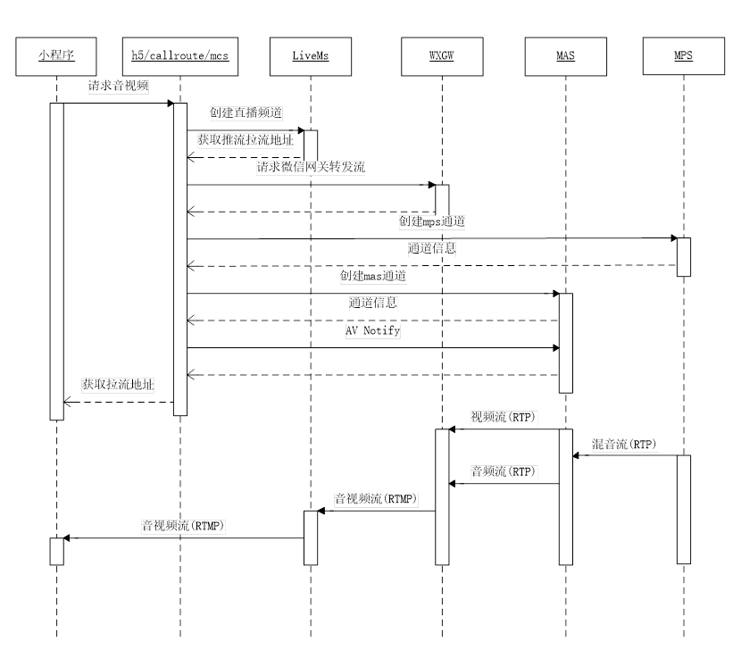

<html>

<head>
<meta http-equiv=Content-Type content="text/html; charset=gb2312">
<meta name=Generator content="Microsoft Word 15 (filtered)">

</head>

<body lang=ZH-CN link=blue vlink="#954F72" style='text-justify-trim:punctuation'>

<h1><a name="_Toc37241872">微信小程序网关设计方案</a></h1>

目录

<a
href="#_Toc37241872">微信小程序网关设计方案... 1</a>

<a
href="#_Toc37241873">需求... 1</a>

<a
href="#_Toc37241874">应用场景... 1</a>

<a
href="#_Toc37241875">小程序仅加入会议... 1</a>

<a
href="#_Toc37241876">小程序与一个APP. 1</a>

<a
href="#_Toc37241877">小程序与多个APP. 1</a>

<a
href="#_Toc37241878">两个小程序... 1</a>

<a
href="#_Toc37241879">多个app与多个小程序... 1</a>

<a
href="#_Toc37241880">模块... 1</a>

<a
href="#_Toc37241881">微信网关结构图... 1</a>

<a
href="#_Toc37241882">交互流程... 1</a>

<a
href="#_Toc37241883">小程序加入会议流程... 1</a>

<a
href="#_Toc37241884">多个小程序请求同一app视频不包括声音流程... 1</a>

<a
href="#_Toc37241885">小程序请求视频流程... 1</a>

&nbsp;

&nbsp;

<h1><a name="_Toc37241873">需求</a></h1>

1.小程序加入会议，其他客户端能看到小程序会议的视频与声音

2.小程序需要其他客户端视频与声音

3.其他客户端能看到小程序会议音视频

4.可以多个小程序加入会议

5.小程序可以获取其他小程序的会议音视频

&nbsp;

<h1><a name="_Toc37241874">应用场景</a></h1>

&nbsp;&nbsp; 小程序加入会议有多种场景

<h2><a name="_Toc37241875">小程序仅加入会议</a></h2>

&nbsp;&nbsp; 

&nbsp;&nbsp;&nbsp; 这种场景应用是小程序加入会议后，只需要会议声音，不需要看其他的视频

&nbsp;

<h2><a name="_Toc37241876">小程序与一个APP</a></h2>

小程序与app加入会议后，小程序需要看到app的视频，同时与需要会议的声音， app也需要看到小程序的视频，同时听到会议的声音

&nbsp;

<h2><a name="_Toc37241877">小程序与多个APP</a></h2>

&nbsp;

小程序与多个app加入会议， 每个app需要会议声音与其他app与小程序的视频，小程序需要会议声音与所有app的视频 
 

<h2><a name="_Toc37241878">两个小程序</a></h2>

两个小程序加入会议后，小程序1需要会议声音与小程序2的视频， 小程序2需要会议声音与小程序1的视频

&nbsp;

<h2><a name="_Toc37241879">多个app与多个小程序</a></h2>

多个小程序与多个app加入会议后， 每个app或小程序需要看到其他所视频以及会议的声音

<h1><a name="_Toc37241880">模块</a></h1>

<h2><a name="_Toc37241881">微信网关结构图</a></h2>

<b>微信网关程序</b>主要功能将小程序推到直播服务器的音视频流，拉过来之后，将音视频解复用，再将音频与视频分别推送给会议系统的mas, 这样小程序就加入会议开会。同时微信网关与会将会议中其他app的音视频拉过来之后，再将复合成rtmp流推到直播服务器，然后小程序将可以拉到其他app的音视频

每个小程序加入同一会议后，将这个会议的声音返回给小程序，这路声音是从会议mas中传送过来，rtpRecver收到之后将放入该小程序的audio Pub与video pub中，如果小程序只需要声音，flv muxer订阅该通道的audio, 转发到直播服务器，小程序再从直播服务器拉流。如果同时小程序需要其他app视频，需要通过mas将app视频传送过来，flv muxer将音频与视频复后成一路rtmp推送到直播服务器。

小程序请求视频有两种情况，一种时请求app的视频需要通过mas传送过来，另外一种时同会议中其他小程序的视频，因为其他小程序视频是通过微信网关拉过来，再转发到mas, 所以其他小程序的视频，在转发mas 需要放到video pub, 如果有其他小程序需要该视频，直接订阅之后，再通过flv muxer复后之后发送到直播服务器

同一会议的所有小程序音视频处理，需要确保在同一个微信网关程序处理，集群环境也需要这样

<h2><a name="_Toc37241882">交互流程</a></h2>

<h3><a name="_Toc37241883">小程序加入会议流程</a></h3>

<h3><a name="_Toc37241884">多个小程序请求同一app视频不包括声音流程</a></h3>

<h3><a name="_Toc37241885">小程序请求视频流程</a></h3>

&nbsp;

&nbsp;

<h4>请求普通成员视频: </h4>

&nbsp;&nbsp;&nbsp;&nbsp;&nbsp; 1只需要视频：&nbsp; 如果成员已经在wxgw, 直接到直播服务器拉流，否则将该成员的会议视频从mas推流到wxgw. 同时推流到直播服务器，再从直播服务拉流

&nbsp;&nbsp;&nbsp;&nbsp;&nbsp; 2.需要视频同时需要混音, 首先走只需要视频流程，同时将该成员视频与小程序成员的混音合同一路直播流，推流直播服务器，再拉流

<h4>请求小程序成员视频:&nbsp; </h4>

1． 只要视频，

方案1:在wxgw检查有没有该小程序rtmp2rtp,
如果没有创建一个，然后解复合video, audio, 然后将video到推直播服务器，

方案2:直在从直播服务器拉小程序参与的rtmp流，包括有AV, 小程序播放时，把A禁用

&nbsp;&nbsp;&nbsp;&nbsp;&nbsp; 2.需要混音

wxgw拉流后解复合video, audio, 再将video与小程序混音复合成rtmp流

&nbsp;

</body>

</html>
